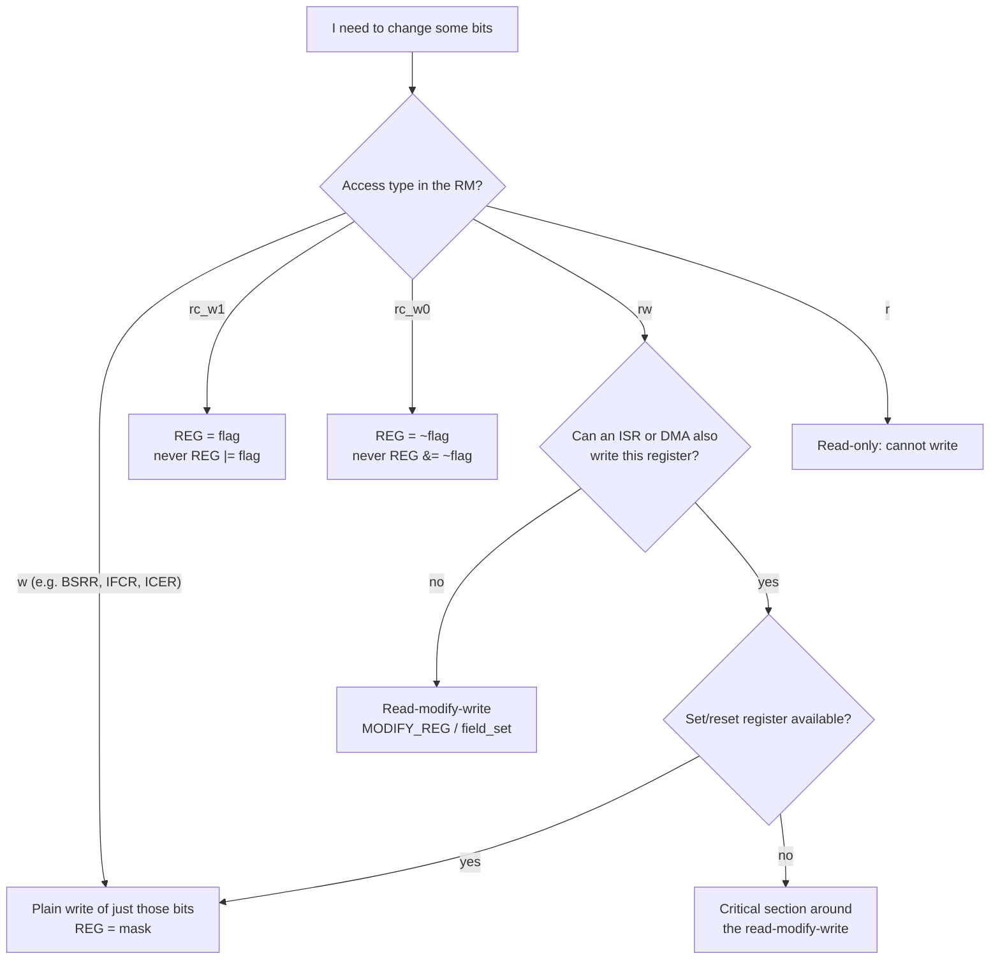

## Learning objectives

By the end of this lesson you will be able to:

1. **Apply** the six bitwise operators `& | ^ ~ << >>` and state the register job each one does (test, set, toggle, invert, build a mask, extract a field).
2. **Build** single-bit and multi-bit masks with `1UL << n` and the CMSIS `_Pos` / `_Msk` macros, starting from a register diagram in the reference manual.
3. **Set, clear, toggle and test** bits, and **read and write multi-bit fields**, without disturbing the other bits of the register (the `MODIFY_REG` pattern).
4. **Choose the correct write pattern for each register access type**: `rw` (read-modify-write), write-only set/reset registers (`BSRR`), `rc_w0` flags (`SR = ~flag`) and `rc_w1` flags (`PR = flag`). Explain what breaks when you pick the wrong one.
5. **Explain** why `REG |= mask` is not atomic, and fix the resulting race three ways: set/reset registers, a critical section, bit-banding.
6. **Use** the standard bit tricks (edge detection with XOR, counting bits, finding the lowest set bit, power-of-two test, shift vs divide) and recognise the Cortex-M4 instructions they compile to.

## Why this matters

An industrial gateway forwards Modbus frames between an RS-485 bus and Ethernet. In the lab it runs for days. In the field, one frame in a few thousand fails its CRC check. Nobody can reproduce it on the bench.

The cause is one line in the UART transmit-complete handler:

```c
USART2->SR &= ~USART_SR_TC;   /* "clear the TC flag" */
```

That line reads the status register, clears one bit in a copy, and writes the copy back. If a byte finishes arriving during those two or three clock cycles, the hardware sets `RXNE` after the read, and the write-back **clears it again**. The driver never sees the byte, and the frame is one byte short. ST's own HAL clears the flag with `USART2->SR = ~USART_SR_TC;` precisely to avoid this.

Every peripheral you'll configure in this course is a set of 32-bit registers full of 1-, 2-, 3- and 4-bit fields. Almost every line of driver code is a bit operation, and each one has exactly this kind of hidden edge case. This lesson makes the edge cases visible. You'll reuse it directly in:
- GPIO drivers (A5.2) and pin atomicity (A5.3)
- EXTI pending flags (A6.3) and ISR shared data (A6.5)
- Timer flags (A7.2), UART status handling (A8.3) and SPI data width (A9.2)
- CRC (A14.5), and FreeRTOS event groups and notification bits (B6.1, B7.2)

## Concept explanation

````layer beginner
### A register is a row of 32 switches

A peripheral register is a 32-bit number at a fixed address. Each bit, or small group of bits, controls one thing: *"turn on the clock for GPIOA"*, *"pin 5 is an output"*, *"a byte has arrived"*.

```callout analogy title="Analogy: a panel of 32 light switches"
Picture a wall panel with 32 switches, numbered 31 on the left down to 0 on the right. Other people's lights are wired to most of them. You're allowed to flip **your** switch, but you must leave the other 31 exactly as they are. You can't flip one switch without looking at the others: you have to know which one is yours, and touch only that one. That's what a *mask* is for.
```

### The four bitwise operators you'll use every day

They work on each bit position independently:

| a | b | `a & b` (AND) | `a \| b` (OR) | `a ^ b` (XOR) |
|---|---|---|---|---|
| 0 | 0 | 0 | 0 | 0 |
| 0 | 1 | 0 | 1 | 1 |
| 1 | 0 | 0 | 1 | 1 |
| 1 | 1 | 1 | 1 | 0 |

Plus `~a` (NOT), which flips every bit. In words:
- **AND** is 1 only where *both* are 1. Use it to *keep* or *test* bits.
- **OR** is 1 where *either* is 1. Use it to *force bits to 1*.
- **XOR** is 1 where they *differ*. Use it to *flip* bits, or to *find changes*.
- **NOT** flips everything. Use it to turn "the bits I want" into "every bit except those".

### Masks and the four register operations

A **mask** is a number with 1s exactly at the bits you want to touch. The mask for bit *n* is `1UL << n`: a single 1, shifted left *n* places.

| Goal | C | Why it works |
|---|---|---|
| **Set** bit *n* to 1 | `reg \|= (1UL << n);` | x OR 1 = 1; x OR 0 = x (others unchanged) |
| **Clear** bit *n* to 0 | `reg &= ~(1UL << n);` | x AND 0 = 0; x AND 1 = x |
| **Toggle** bit *n* | `reg ^= (1UL << n);` | x XOR 1 = NOT x; x XOR 0 = x |
| **Test** bit *n* | `(reg & (1UL << n)) != 0U` | Keeps only bit *n*; non-zero means it was 1 |

The `UL` suffix matters. `1 << 31` is undefined behaviour because `1` is a signed `int` (lesson A0.1), and `1UL << 31` is not.

Try each operation. Click any bit of `REG` to change it, pick an operation and a bit number, then write the result back:

```anim
bit-ops-playground
```

### Hex is binary in groups of four

Reference manuals give register values in hexadecimal because each hex digit is exactly 4 bits (a *nibble*):

| Hex | Binary | Hex | Binary | Hex | Binary | Hex | Binary |
|---|---|---|---|---|---|---|---|
| 0 | 0000 | 4 | 0100 | 8 | 1000 | C | 1100 |
| 1 | 0001 | 5 | 0101 | 9 | 1001 | D | 1101 |
| 2 | 0010 | 6 | 0110 | A | 1010 | E | 1110 |
| 3 | 0011 | 7 | 0111 | B | 1011 | F | 1111 |

So `0xA8000400` is `1010 1000 0000 0000 0000 0100 0000 0000`, and you can read bit positions straight from it: the `4` in the third-from-right digit is bit 10. After a week of firmware work you'll read hex like this without thinking.
````

````layer intermediate
### Reading a register diagram

Every register in RM0390 is drawn the same way. Here is `GPIOx_MODER`, the *port mode register* (offset `0x00`):

| Bits | 31:30 | 29:28 | … | 11:10 | … | 1:0 |
|---|---|---|---|---|---|---|
| Field | `MODER15[1:0]` | `MODER14[1:0]` | … | `MODER5[1:0]` | … | `MODER0[1:0]` |
| Access | rw | rw | … | rw | … | rw |

`MODERy[1:0]`: `00` input, `01` general-purpose output, `10` alternate function, `11` analog.
Reset value: **`0xA800 0000` for port A**, `0x0000 0280` for port B, `0x0000 0000` for the other ports.

Two things to take from this:
1. Pin *y*'s field starts at bit **2·y**. For PA5 that's bit 10, so the field mask is `0x3UL << 10` = `0x00000C00`.
2. Port A does **not** reset to zero. PA13, PA14 and PA15 start in alternate-function mode (`10`), because they're the SWD/JTAG debug pins. Any code that writes a whole value into `GPIOA->MODER` without preserving those bits disconnects your debugger.

### CMSIS names every field for you

The device header `stm32f446xx.h` defines three macros per field, following one pattern: `PERIPHERAL_REGISTER_FIELD_suffix`.

```c
#define GPIO_MODER_MODER5_Pos   (10U)                                  /* first bit */
#define GPIO_MODER_MODER5_Msk   (0x3UL << GPIO_MODER_MODER5_Pos)       /* 0x00000C00 */
#define GPIO_MODER_MODER5       GPIO_MODER_MODER5_Msk
#define GPIO_MODER_MODER5_0     (0x1UL << GPIO_MODER_MODER5_Pos)       /* 0x00000400 */
#define GPIO_MODER_MODER5_1     (0x2UL << GPIO_MODER_MODER5_Pos)       /* 0x00000800 */
```

(Newer headers also define the alias `GPIO_MODER_MODE5_Pos` etc.) Use these names, never raw numbers. `GPIO_MODER_MODER5_Msk` is self-documenting, and `0xC00` is not.

### Multi-bit fields: clear first, then set

To write a value *v* into a field, you need **two** operations, and `|=` alone is not enough:

```c
reg = (reg & ~FIELD_Msk) | ((v << FIELD_Pos) & FIELD_Msk);
```

The `& ~Msk` empties the field, and the `| (v << Pos)` fills it. The final `& Msk` guarantees that a too-large *v* can't spill into the neighbouring field. CMSIS packages this as `MODIFY_REG`. Here's what it does to `GPIOA->MODER`, and the two classic ways to get it wrong:

```anim
field-rmw
```

### The CMSIS bit macros

These are defined in `stm32f4xx.h`. There is no magic in them:

| Macro | Definition |
|---|---|
| `SET_BIT(REG, BIT)` | `((REG) \|= (BIT))` |
| `CLEAR_BIT(REG, BIT)` | `((REG) &= ~(BIT))` |
| `READ_BIT(REG, BIT)` | `((REG) & (BIT))` |
| `CLEAR_REG(REG)` | `((REG) = (0x0))` |
| `WRITE_REG(REG, VAL)` | `((REG) = (VAL))` |
| `READ_REG(REG)` | `((REG))` |
| `MODIFY_REG(REG, CLEARMASK, SETMASK)` | `WRITE_REG((REG), (((READ_REG(REG)) & (~(CLEARMASK))) \| (SETMASK)))` |
| `POSITION_VAL(VAL)` | `(__CLZ(__RBIT(VAL)))`: index of the lowest set bit |

Notice that `SET_BIT`, `CLEAR_BIT` and `MODIFY_REG` are all **read-modify-write**. That's correct for ordinary `rw` registers, and **wrong** for several important registers, as the next section shows.

### Not every register bit behaves like memory

The reference manual labels every bit with an **access type** (RM0390, *Documentation conventions → List of abbreviations for registers*). The write pattern must match it:

| Type | Meaning | How to change one bit |
|---|---|---|
| `rw` | read/write | Read-modify-write: `\|=`, `&= ~`, `MODIFY_REG` |
| `r` | read-only | Can't be written (writes are ignored) |
| `w` | write-only (reads return 0) | Plain write of the bits you want: `GPIOx->BSRR = BIT(n);` |
| `rc_w0` | read, **cleared by writing 0**; writing 1 has no effect | `REG = ~FLAG;`, **never** `REG &= ~FLAG;` |
| `rc_w1` | read, **cleared by writing 1**; writing 0 has no effect | `REG = FLAG;`, **never** `REG \|= FLAG;` |
| `rc_r` | cleared by reading | Be careful what (and who) reads it, including the debugger |

Examples on the F446: `USART_SR.TC` and `USART_SR.RXNE` are `rc_w0`, `TIMx_SR.UIF` is `rc_w0`, and `EXTI_PR` is `rc_w1`. ST's HAL gets these right, and you can use it as a reference:

```c
#define __HAL_UART_CLEAR_FLAG(__HANDLE__, __FLAG__)  ((__HANDLE__)->Instance->SR = ~(__FLAG__))
#define __HAL_TIM_CLEAR_FLAG(__HANDLE__, __FLAG__)   ((__HANDLE__)->Instance->SR = ~(__FLAG__))
#define __HAL_GPIO_EXTI_CLEAR_IT(__EXTI_LINE__)      (EXTI->PR = (__EXTI_LINE__))
```

Watch why the read-modify-write version loses events:

```anim
flag-clear
```

### Set/reset registers: atomic by design

`GPIOx_BSRR` (*bit set/reset register*, offset `0x18`, write-only) exists so you never have to read-modify-write the output register:

- Writing 1 to bit *n* (0–15) **sets** pin *n*.
- Writing 1 to bit *n*+16 **resets** pin *n*.
- Writing 0 does nothing. If both are 1, **set wins**.

`GPIOA->BSRR = (1UL << 5);` is one store instruction, and it can't disturb any other pin. That's why HAL implements `HAL_GPIO_WritePin()` with `BSRR`, and why the next animation matters:

```anim
rmw-race
```

The same set/clear idea appears all over the chip: the NVIC's `ISER`/`ICER` (enable and disable an interrupt by writing 1) and the DMA flag-clear registers `LIFCR`/`HIFCR`, for example.

### Shifts in detail

| Expression | Result | Rule |
|---|---|---|
| `x << n` (unsigned) | Bits move left; zeros enter; top bits are lost | Well defined, = x·2ⁿ mod 2³² |
| `x >> n` (unsigned) | Zeros enter from the left (**logical** shift, `LSRS`) | Well defined, = ⌊x / 2ⁿ⌋ |
| `x >> n` (signed, negative) | GCC copies the sign bit in (**arithmetic** shift, `ASRS`) | Implementation-defined |
| `x << n` (signed, negative) | — | **Undefined behaviour** |
| `x << n`, `x >> n` with n ≥ 32 or n < 0 | — | **Undefined behaviour** |

Remember promotion (A0.1): a `uint8_t` or `int8_t` operand is first widened to `int`, so the fill bits come from the *promoted* value. Explore it:

```anim
shift-lab
```

### Everyday bit tricks

| Trick | Code | Use |
|---|---|---|
| Changed bits | `changed = now ^ previous;` | Detect edges on a whole port at once |
| Rising edges | `changed & now` | Bits that went 0 → 1 |
| Falling edges | `changed & previous` | Bits that went 1 → 0 |
| Lowest set bit (value) | `x & (0U - x)` | Isolate the next pending flag |
| Lowest set bit (index) | `__builtin_ctz(x)` or `POSITION_VAL(x)` | Which line/channel fired (x ≠ 0!) |
| Power of two? | `x && !(x & (x - 1U))` | Validate ring-buffer sizes (A8.4) |
| Count 1 bits | `x &= x - 1U` in a loop | Each pass clears the lowest 1 |
| Signed field | `(int32_t)(raw ^ sign) - (int32_t)sign` | Sign-extend an N-bit field portably |

### Reading the documentation

- **RM0390** → *General-purpose I/Os (GPIO) → GPIO registers*: every GPIO register with its reset value and access type. *Documentation conventions* for the access-type abbreviations.
- **Your device header** `stm32f446xx.h`: search for a register name to find all its `_Pos`/`_Msk` macros.
- **`stm32f4xx_hal_gpio.c`**: `HAL_GPIO_WritePin()` and `HAL_GPIO_TogglePin()` are short and worth reading. Both use `BSRR`.
````

````layer advanced
### What each idiom compiles to (GCC 10.3, `-O2`, verified)

| C | Cortex-M4 instructions |
|---|---|
| `GPIOA->ODR \|= GPIO_ODR_OD5;` | `LDR` · `ORR r3, #32` · `STR` |
| `GPIOA->ODR &= ~GPIO_ODR_OD5;` | `LDR` · `BIC r3, #32` · `STR` |
| `GPIOA->ODR ^= GPIO_ODR_OD5;` | `LDR` · `EOR r3, #32` · `STR` |
| `GPIOA->BSRR = GPIO_BSRR_BS5;` | `MOVS r2, #32` · `STR` (a single store) |
| `(GPIOC->IDR & GPIO_IDR_ID13) != 0U` | `LDR` · `UBFX r0, r0, #13, #1` |
| `MODIFY_REG(GPIOA->MODER, …5_Msk, 1UL << 10)` | `LDR` · `BIC #0xC00` · `ORR #0x400` · `STR` |
| `(r >> 10) & 0x3UL` | `UBFX r0, r0, #10, #2` (unsigned bit-field extract) |
| `((int32_t)(r << 20)) >> 28` | `SBFX r0, r0, #8, #4` (signed bit-field extract) |
| `__builtin_ctz(x)` / `POSITION_VAL(x)` | `RBIT` · `CLZ` |
| `__builtin_popcount(x)` | `BL __popcountsi2`: a **library call**, because the M4 has no popcount instruction |
| `(x << n) \| (x >> ((32U - n) & 31U))` | `ROR` (GCC recognises the rotate idiom) |
| `x & (0U - x)` | `NEGS` · `ANDS` |
| `x >> 4` (int32_t) | `ASRS r0, r0, #4` |
| `x / 16` (int32_t) | `CMP` · `IT LT` · `ADDLT r0, #15` · `ASRS`: the fix-up that rounds toward zero |
| `USART2->SR = ~USART_SR_TC;` | `MVN r2, #64` · `STR` (one store) |
| `USART2->SR &= ~USART_SR_TC;` | `LDR` · `BIC` · `STR`, with a race window between the load and the store |

Thumb-2 also has `BFI` (bit-field insert) and `BFC` (bit-field clear). GCC uses them when the inserted value is already in a register; with constant masks it usually prefers `BIC`/`ORR`.

### Why most masks cost nothing: modified immediates

`ORR`, `BIC`, `AND` and `EOR` accept a 32-bit constant encoded in 12 bits. It must be an 8-bit value rotated to any position, or one of the repeating patterns `0x00XY00XY`, `0xXY00XY00` or `0xXYXYXYXY` (ARMv7-M ARM, *Modified immediate constants in Thumb instructions*). Every single-bit and 2-bit field mask fits, so `BIC r3, #0xC00` is one instruction. An arbitrary mask like `0x12345678` doesn't fit, and costs an extra literal-pool load.

### Why read-modify-write isn't atomic, and the fixes

`ODR |= mask` is three instructions. An interrupt can be taken between any two of them. If the handler writes the same register, one of the two writes is lost (the `rmw-race` animation above). The window is only a couple of cycles, so the bug is **rare, load-dependent and nearly impossible to reproduce**, which is the worst kind.

```mermaid caption="Timing of the lost update: main's STR writes back a stale copy"
sequenceDiagram
    participant M as main()
    participant R as GPIOA->ODR
    participant I as TIM ISR
    M->>R: LDR r3 (reads 0x00)
    Note over M: ORR r3, #0x20 (r3 = 0x20)
    I->>R: LDR / ORR #0x40 / STR (ODR = 0x40)
    Note over I: ISR returns
    M->>R: STR r3 (ODR = 0x20, bit 6 lost)
```

The four fixes, in order of preference:

1. **Hardware set/clear registers**: `BSRR`, NVIC `ISER`/`ICER`, DMA `LIFCR`/`HIFCR`. One store, no window. Use them whenever they exist.
2. **Ownership**: only one context (main *or* one ISR) ever writes a given register. Design it that way, and document it.
3. **Critical section** around the read-modify-write (A6.5):

   ```c
   uint32_t primask = __get_PRIMASK();   /* remember whether IRQs were already off */
   __disable_irq();
   GPIOB->ODR = (GPIOB->ODR & ~mask) | value;
   __set_PRIMASK(primask);
   ```
4. **Bit-banding** (Cortex-M3/M4 only, see below).

### Bit-banding

On Cortex-M3 and M4, each bit of the first 1 MB of SRAM (from `0x2000 0000`) and of the peripheral region (from `0x4000 0000`) also appears as a whole 32-bit word in an *alias* region:

> alias address = alias_base + (byte_offset × 32) + (bit × 4)
> Peripheral alias base `0x4200 0000`, SRAM alias base `0x2200 0000`.

For `GPIOA->ODR` bit 5: `GPIOA->ODR` is at `0x4002 0014`, byte offset `0x20014` → `0x4200 0000 + 0x20014 × 32 + 5 × 4 = 0x4240 0294`. Writing 1 there with a single `STR` makes the **bus matrix** perform an indivisible read-modify-write of `ODR`, so no interrupt can land in the middle.

Three caveats that trip people up:
- The bus still does a read-modify-write of the **whole register**. Bit-banding a bit of an `rc_w1` register such as `EXTI_PR` writes back all the other pending bits as 1, which clears them. **Never bit-band a flag register.**
- `alias ^= 1` is a *CPU* read-modify-write of the alias word, so it's **not** atomic (verified: `LDR`, `EOR`, `STR`). Only a plain write of 0 or 1 is.
- Bit-banding **doesn't exist** on Cortex-M0/M0+/M7/M33, so it isn't available on STM32F0, F7, H7 or U5. Portable code prefers set/clear registers.

### Reads with side effects: the debugger can change your program

Some bits clear when **read**. On the F4 USART, reading `DR` clears `RXNE`, and reading `SR` followed by `DR` clears `ORE`. When the IDE's *SFR view* or a live expression refreshes `USART2->DR`, the **debugger** performs that read and silently eats received bytes. That's a classic Heisenbug: the program behaves differently only while you're watching. Keep data registers out of live views, and read flag registers only in the code that owns them.

### Two volatile writes are not one

`volatile` (A0.3) forbids the compiler from merging accesses. These two lines are **six** instructions and two separate bus writes, with the register briefly in an intermediate state:

```c
GPIOA->MODER |= GPIO_MODER_MODER5_0;   /* LDR ORR STR */
GPIOA->MODER |= GPIO_MODER_MODER6_0;   /* LDR ORR STR */
```

Build the complete mask first and write once. On registers where intermediate states matter (the order of `CR1` bits while a peripheral is running, for example), this is a correctness issue, not just a performance one.

### Why CMSIS uses masks rather than C bit-fields

C bit-fields (`struct { uint32_t mode5 : 2; }`) look cleaner, but their bit order, padding and **access width** are implementation-defined. Every assignment is a hidden read-modify-write that you can't see at the call site. CMSIS uses explicit masks so that every register access is visible. Lesson A0.5 covers when bit-fields are and aren't acceptable.
````

## Under the hood

### Registers used in this lesson

All addresses and bits as in RM0390 (STM32F446). GPIOA base `0x4002 0000`, GPIOC base `0x4002 0800`.

| Register | Offset | Access | Used for |
|---|---|---|---|
| `GPIOx_MODER` | 0x00 | rw | 2 bits per pin: 00 in, 01 out, 10 AF, 11 analog. Reset: **0xA800 0000** (port A) |
| `GPIOx_OTYPER` | 0x04 | rw | 1 bit per pin: 0 push-pull, 1 open-drain |
| `GPIOx_OSPEEDR` | 0x08 | rw | 2 bits per pin: output slew rate |
| `GPIOx_PUPDR` | 0x0C | rw | 2 bits per pin: 00 none, 01 pull-up, 10 pull-down |
| `GPIOx_IDR` | 0x10 | r | Input level of each pin (bits 15:0) |
| `GPIOx_ODR` | 0x14 | rw | Output latch (bits 15:0) |
| `GPIOx_BSRR` | 0x18 | w | Bits 15:0 set, bits 31:16 reset; reads return 0 |
| `GPIOx_AFRL` / `AFRH` | 0x20 / 0x24 | rw | 4 bits per pin: alternate function 0–15 (pins 0–7 / 8–15) |
| `USART_SR` | 0x00 | mixed | TXE (7) r, **TC (6) rc_w0**, **RXNE (5) rc_w0** |
| `EXTI_PR` | 0x14 (EXTI at 0x4001 3C00) | **rc_w1** | One pending bit per EXTI line |

### Choosing the write pattern



### What to read

| Document | Section | Why |
|---|---|---|
| RM0390 | *Documentation conventions → List of abbreviations for registers* | The access types `rw`, `r`, `w`, `rc_w0`, `rc_w1`, `rc_r` |
| RM0390 | *GPIO registers*, *USART registers (USART_SR)*, *EXTI registers (EXTI_PR)* | The registers used here |
| RM0390 | *Memory and bus architecture → Bit banding* | Alias formula for the F446 |
| Cortex-M4 Devices Generic User Guide (DUI 0553) | *Memory model → Bit-banding*; instructions *BFC, BFI, SBFX, UBFX, RBIT, CLZ* | Instruction details |
| ARMv7-M Architecture Reference Manual (DDI 0403) | *Modified immediate constants in Thumb instructions* | Which masks fit in one instruction |
| ISO C11 (N1570) | §6.5.3.3 (`~`), §6.5.7 (shifts), §6.5.10–12 (`& ^ \|`) | The language rules |

## Hands-on lab: the register X-ray

**Goal:** see every bit operation happen. The lab prints each GPIO register in binary **before and after** each write, and marks the changed bits with `^`. Then it runs a live loop where button **B1** drives LED **LD2**, printing `GPIOC->IDR` on every edge.

**No wiring needed:** LD2 is on **PA5**, B1 is on **PC13** (active low: pressed reads 0), and the console is USART2 through the ST-LINK VCP, as in A0.1.

### Step 1: CubeMX configuration (HAL version)

Start from the A0.1 project (*File → Copy/Paste the project*, rename it `A0_2_RegisterXray`) or create a new NUCLEO-F446RE project with the default peripherals. Then:

1. **Clock**: System Clock Mux = **HSI**, HCLK = **16 MHz**, APB1/APB2 prescalers **/1** (same as A0.1).
2. **PC13**: change it from `GPIO_EXTI13` (the board default) to **`GPIO_Input`**, User Label **`B1`**, GPIO Pull-up/Pull-down: **Pull-up**.
   *Why:* we poll the pin in this lesson. Interrupts on this pin come in A6.3. The pull-up guarantees a defined level whatever the board's own resistor network.
3. **PA5**: `GPIO_Output`, label **`LD2`**, push-pull, no pull, **Low** speed. (The lab changes the speed at run time and watches the register.)
4. **USART2**: Asynchronous, 115200 8N1 (the default).
5. **Warnings**: `-Wall -Wextra -Wconversion -Wsign-conversion -Wshadow`, as in A0.1. Generate code.

### Step 2: add the lab library

`bits.h` holds the helpers (pure functions on values, unit-testable on a PC). `xray.c` prints registers. `bits_selftest.c` checks every helper against hand-computed values.

```c file=A0.2/Core/Inc/bits.h
```

```c file=A0.2/Core/Inc/xray.h
```

```c file=A0.2/Core/Src/xray.c
```

```c file=A0.2/Core/Inc/bits_selftest.h
```

```c file=A0.2/Core/Src/bits_selftest.c
```

### Step 3: HAL `main.c`

This version drives the pins through the HAL API, and X-rays the registers to show what each HAL call really does.

```c file=A0.2/Core/Src/main.c
```

### Step 4: register-level version

Create an **Empty** project as in A0.1 (copy `Drivers/CMSIS`, add the include paths, define `STM32F446xx`). Add the lab library files and this `main.c`:

```c file=A0.2/Core/Src/main_reg.c
```

### Step 5 (optional): on your PC

```c file=A0.2/host/host_main.c
```

```bash title="PC build"
gcc -std=c11 -O2 -Wall -Wextra -ICore/Inc host/host_main.c Core/Src/bits_selftest.c Core/Src/xray.c -o xray
./xray
```

### Line-by-line: the non-obvious lines

| Line | Explanation |
|---|---|
| `#define FIELD_MASK(width, pos) (((width) >= 32U) ? 0xFFFFFFFFUL : …)` | `1UL << 32` is undefined, so the full-width case is special-cased. With constant arguments the compiler folds this to a constant; no branch remains. |
| `return (value & ~mask) \| ((field << pos) & mask);` | The final `& mask` clips an out-of-range field value. `field_set(…, 7U)` on a 2-bit field writes `11`, never a stray bit into the next pin's field. The self-test checks exactly that. |
| `return (int32_t)(raw ^ sign) - (int32_t)sign;` | Flipping the sign bit maps the field to 0 … 2ʷ−1, and subtracting 2ʷ⁻¹ gives the signed value. It has no implementation-defined shifts or casts. |
| `value &= value - 1U;` | Subtracting 1 flips the lowest 1 and every 0 below it, so the AND clears exactly the lowest 1. The loop runs once per set bit. |
| `static inline void reg_modify(volatile uint32_t *reg, …)` | The only function that touches hardware. It makes the single read and single write explicit, and documents that it is **not** atomic. |
| `const uint32_t changed = before ^ after;` (xray.c) | XOR marks exactly the positions that differ. The same trick detects button edges in `main_reg.c`. |
| `for (uint32_t rest = changed; rest != 0U; rest &= rest - 1U)` | Visits each changed bit once, lowest first. `__builtin_ctz(rest)` gives its index. |
| `#define BSRR_RESET(pin) BIT((pin) + 16U)` | The reset half of `BSRR` starts at bit 16. `BSRR_RESET(5)` is bit 21. |
| `GPIOA->MODER = field_set(GPIOA->MODER, PIN2_MASK(LED_PIN), PIN2_POS(LED_PIN), MODER_OUTPUT);` | Read, replace one 2-bit field, write. The PA13/PA14 debug bits are preserved, and the X-ray proves it by showing a single changed bit. |
| `reg_modify(&GPIOA->AFR[0], …)` | `AFR[0]` is AFRL (pins 0–7). PA2/PA3 each get a 4-bit field at positions 8 and 12. |
| `const bool pressed = !bits_any_set(now, BIT(BUTTON_PIN));` | B1 connects PC13 to ground when pressed, so pressed = bit **clear**. |
| `GPIOA->BSRR = pressed ? BSRR_SET(LED_PIN) : BSRR_RESET(LED_PIN);` | One store, whatever state the LED was in. There's no read, so nothing to race with. |
| `Xray_Show("GPIOA->BSRR", GPIOA->BSRR);` (HAL version) | Proves that `BSRR` is write-only: it always reads back as 0. |
| `HAL_GPIO_TogglePin()` | Reads `ODR`, then writes `BSRR` with *set* bits for the requested pins that are low and *reset* bits for those that are high. Other pins are never written. |

### Step 6: run and verify

Build (0 warnings expected; both versions were compiled with GCC 10.3 under the flags above at `-O0` and `-O2`), open the VCP at 115200, flash, and press **RESET**.

**Register-level version**: every value below is determined by RM0390 reset values and the code, so your output should match exactly:

```console title="USART2 @ 115200 — main_reg.c"
=== A0.2 Register X-ray (registers) ===
bits.h self-test: 30/30 checks passed

--- PA5 -> output: MODER field [11:10] = 01 ---
                                  31        23        15        7       0
GPIOA->MODER   before 0xA80000A0  1010 1000 0000 0000 0000 0000 1010 0000
               after  0xA80004A0  1010 1000 0000 0000 0000 0100 1010 0000
                                                            ^
                                  changed bits: 10

--- PC13 -> input with pull-up: MODER[27:26] = 00, PUPDR[27:26] = 01 ---
                                  31        23        15        7       0
GPIOC->MODER   before 0x00000000  0000 0000 0000 0000 0000 0000 0000 0000
               after  0x00000000  0000 0000 0000 0000 0000 0000 0000 0000
                                  (no change)
GPIOC->PUPDR   before 0x00000000  0000 0000 0000 0000 0000 0000 0000 0000
               after  0x04000000  0000 0100 0000 0000 0000 0000 0000 0000
                                        ^
                                  changed bits: 26

--- Three ways to drive PA5 ---
                                  31        23        15        7       0
BSRR set       before 0x00000000  0000 0000 0000 0000 0000 0000 0000 0000
               after  0x00000020  0000 0000 0000 0000 0000 0000 0010 0000
                                                                  ^
                                  changed bits: 5
BSRR reset     before 0x00000020  0000 0000 0000 0000 0000 0000 0010 0000
               after  0x00000000  0000 0000 0000 0000 0000 0000 0000 0000
                                                                  ^
                                  changed bits: 5
ODR ^= BIT(5)  before 0x00000000  0000 0000 0000 0000 0000 0000 0000 0000
               after  0x00000020  0000 0000 0000 0000 0000 0000 0010 0000
                                                                  ^
                                  changed bits: 5
ODR ^= BIT(5)  before 0x00000020  0000 0000 0000 0000 0000 0000 0010 0000
               after  0x00000000  0000 0000 0000 0000 0000 0000 0000 0000
                                                                  ^
                                  changed bits: 5

--- Bit tricks on 0xA8000000 (GPIOA->MODER reset value) ---
ones = 3, lowest set bit = 27, PA15 mode = 2, PA13 mode = 2

Press B1: LED follows the button; each edge prints GPIOC->IDR.
PRESS   #1
GPIOC->IDR     before 0x00002000  0000 0000 0000 0000 0010 0000 0000 0000
               after  0x00000000  0000 0000 0000 0000 0000 0000 0000 0000
                                                        ^
                                  changed bits: 13
RELEASE #1
GPIOC->IDR     before 0x00000000  0000 0000 0000 0000 0000 0000 0000 0000
               after  0x00002000  0000 0000 0000 0000 0010 0000 0000 0000
                                                        ^
                                  changed bits: 13
```

This exact text was produced by running the same `xray.c` and `bits.h` code on a PC with the register values the board will have. In `GPIOC->IDR` the example shows the other bits as 0. On your board, the bits other than 13 depend on what's connected to the other port C pins, but only bit 13 should be marked as changed.

Things to check in that output:
- `GPIOA->MODER` before is `0xA80000A0`, not the reset value `0xA8000000`: the UART init already put PA2/PA3 (bits 7:4) in AF mode. Configuring PA5 changed **one bit**, and the debug pins' `10 10 10` at the top survived.
- Setting `PC13` to input changed **nothing**: it already was. The pull-up changed exactly bit 26.
- **Bit tricks:** `0xA8000000` has three 1s (bits 31, 29, 27), its lowest set bit is 27, and PA15/PA13 read mode `2` (alternate function, the debug port).

**HAL version**: the first lines are the same self-test, then:
- `WritePin SET` changes ODR bit 5; `TogglePin` changes it back.
- `GPIOA->BSRR` reads **0x00000000**, because it's write-only.
- Each `HAL_GPIO_Init(Speed)` shows **only bits 11:10** of `OSPEEDR` changing, and the printed speed field counts 0 → 1 → 2 → 3. (The first call, `LOW`, prints `(no change)`: CubeMX already set it. The other bits of `OSPEEDR` come from the reset value and from the UART pins set up by `HAL_UART_MspInit()`.)
- `PA5 mode field (MODER[11:10]) = 1`.

**LD2 lights while B1 is held.** If you ever see two `PRESS` lines for one press, that's contact bounce getting past the 10 ms sampling. Debouncing properly is lesson A5.5.

**In the debugger:** open *SFRs → GPIOA*, single-step over the `GPIOA->MODER = field_set(…)` line, and watch exactly one field change. Then try the same on `USART2 → DR` while typing into the terminal: received characters disappear, because the SFR view reads `DR` (see the 🔴 layer).

## Common mistakes & debugging

### 1. Setting a multi-bit field with `|=` only
- **Symptom:** a pin that was analog (`11`) or AF (`10`) never becomes an output: `MODER |= (1UL << 10)` leaves `11`. A timer prescaler "sticks" at an old value.
- **Why:** OR can only turn bits on. It never clears the old value.
- **Diagnose:** X-ray or the SFR view shows the field isn't the value you wrote.
- **Fix:** clear then set: `MODIFY_REG(reg, FIELD_Msk, value << FIELD_Pos)`.

### 2. Writing a whole register with `=` when you only own one field
- **Symptom:** right after `GPIOA->MODER = GPIO_MODER_MODER5_0;` the debug session drops and the board can't be re-flashed normally.
- **Why:** you wrote 0 into PA13/PA14's fields, turning the SWD pins into plain inputs.
- **Fix:** read-modify-write. To recover the board, connect under reset (hold RESET, start the connection, release). A3.3 shows how.

### 3. Operator precedence: `&` vs `==`
- **Symptom:** `if (GPIOC->IDR & (1UL << 13) == 0U)` is **never** true.
- **Why:** `==` binds tighter than `&`, so this is `IDR & ((1UL << 13) == 0U)`, which is `IDR & 0`. GCC compiles the condition to a constant `false`.
- **Diagnose:** `-Wall` warns: *"suggest parentheses around comparison in operand of '&' [-Wparentheses]"*.
- **Fix:** always bracket the mask: `if ((GPIOC->IDR & (1UL << 13)) == 0U)`.

### 4. Clearing flags with read-modify-write
- **Symptom:** lost UART bytes (`SR &= ~TC`), lost timer updates (`TIMx->SR &= ~UIF`), or missing EXTI interrupts (`EXTI->PR |= line`), all rare and load-dependent.
- **Why:** `rc_w0`/`rc_w1` bits get written back with stale or unintended values (see the flag-clear animation).
- **Fix:** `rc_w0`: `REG = ~FLAG;`. `rc_w1`: `REG = FLAG;`. Check the access type in the RM for every status register you touch.

### 5. `ODR` read-modify-write shared with an interrupt
- **Symptom:** an output driven by an ISR occasionally switches off by itself, once a day or once a week.
- **Why:** main's `ODR |= / ^=` read-modify-write overwrote the ISR's change.
- **Diagnose:** it goes away when you disable the interrupt; toggle a spare pin in both places and capture on a logic analyzer.
- **Fix:** `BSRR`, or make a single context the only writer of that port.

### 6. Pin *mask* used as a pin *number*
- **Symptom:** `1UL << GPIO_PIN_5` sets nothing (or garbage). With a constant, GCC warns *"left shift count >= width of type [-Wshift-count-overflow]"*.
- **Why:** HAL's `GPIO_PIN_5` is already a mask, `0x0020` (= 32). Shifting by 32 is undefined behaviour.
- **Fix:** keep masks and positions apart in the names (`_Msk` vs `_Pos`, `GPIO_PIN_x` vs pin numbers). Never shift by a mask.

### 7. Forgetting that 2-bit fields start at `2 × pin`
- **Symptom:** configuring pin 5 changes pin 2's mode (`0x3UL << 5` spans bits 6:5, half of pin 2's field and half of pin 3's).
- **Fix:** name the position explicitly: `PIN2_POS(pin) = pin * 2U`, `AFR position = (pin % 8U) * 4U`. Or use the CMSIS `_Pos` macros, which are always right.

### 8. Testing a multi-bit field with a bare `&`
- **Symptom:** `if (GPIOA->MODER & GPIO_MODER_MODER5_Msk)` is meant to mean "PA5 is an output", but it is also true when PA5 is in AF or analog mode.
- **Why:** `& Msk` is non-zero for any field value except `00`.
- **Fix:** compare the whole field: `(GPIOA->MODER & GPIO_MODER_MODER5_Msk) == (1UL << GPIO_MODER_MODER5_Pos)`, or `field_get(…) == 1U`.

### 9. Shifting a signed value
- **Symptom:** `-7 >> 1` gives −4 and `-7 / 2` gives −3, so an averaging filter drifts negative. `x << 3` on a negative sensor value is UB.
- **Fix:** do bit manipulation on `uint32_t` only. Use `/` for arithmetic, or document the rounding when you deliberately use `>>`.

### 10. The debugger reads registers too
- **Symptom:** UART bytes go missing only while the SFR view or a live expression shows `USART2`.
- **Why:** reading `DR` clears `RXNE`; the debugger's read counts.
- **Fix:** don't keep data or `rc_r` registers in live views. Capture state in variables inside your code instead.

## Best practices & production tips

```callout production title="How professional drivers handle bits"
- **Names, not numbers.** Use the CMSIS `_Pos` / `_Msk` macros or your own `FIELD_MASK()`-style helpers. A reviewer should never have to decode `0xC00`.
- **Match the access type every time.** Code review question for every status-register write: *is this bit `rc_w0`, `rc_w1` or `rw`?* Grep your codebase for `SR &=` and `PR |=`.
- **Prefer set/clear registers** (`BSRR`, `ISER`/`ICER`, DMA `IFCR`) over read-modify-write whenever the hardware offers them.
- **One writer per register.** Where two contexts must share one, wrap the read-modify-write in a critical section and write down why in a comment.
- **Configure while disabled, with whole-register writes.** A peripheral you fully own and haven't enabled yet (`USART2->CR1` before `UE`) can be written with `=`; it's clearer and has no read.
- **Combine masks** and write each register once. Intermediate states can matter.
- **Unsigned only.** MISRA C:2012 Rule 10.1 forbids bitwise operators on signed operands. `-Wsign-conversion` catches most violations.
- **Unit-test bit helpers on the host** (like `bits_selftest.c`) and `_Static_assert` masks you rely on: `_Static_assert(GPIO_MODER_MODER5_Msk == 0xC00UL, "MODER5 mask");`
- **Keep the debugger honest.** Remove data registers and read-to-clear flags from live views.
```

## Quiz

```quiz
[
  {
    "q": "`REG = 0xA8000000;` then `REG &= ~(3UL << 10); REG |= (1UL << 10);`. What is REG?",
    "options": ["`0x00000400`", "`0xA8000400`", "`0xA8000C00`", "`0xA8000800`"],
    "answer": 1,
    "why": "The AND clears bits 11:10 (already 0) and keeps everything else; the OR sets bit 10. The top bits 0xA8 are untouched: that's the whole point of masking."
  },
  {
    "q": "TC and RXNE in `USART2->SR` are rc_w0 bits. Which line clears TC without any risk of clearing RXNE?",
    "options": ["`USART2->SR &= ~USART_SR_TC;`", "`USART2->SR |= USART_SR_TC;`", "`USART2->SR = ~USART_SR_TC;`", "`CLEAR_BIT(USART2->SR, USART_SR_TC);`"],
    "answer": 2,
    "why": "A single write of all ones except TC: writing 1 to an rc_w0 bit does nothing, so only TC clears. Options A and D are the same read-modify-write, which can clear an RXNE set between the read and the write. Option B clears nothing."
  },
  {
    "q": "What does `if (GPIOC->IDR & (1UL << 13) == 0U) { … }` do?",
    "options": ["Runs the block when PC13 is low", "Runs the block when PC13 is high", "Never runs the block", "Does not compile"],
    "answer": 2,
    "why": "`==` has higher precedence than `&`: the condition is `IDR & ((1UL << 13) == 0U)` = `IDR & 0` = 0. GCC folds it to false and -Wall warns with -Wparentheses."
  },
  {
    "q": "Why is `GPIOA->BSRR = GPIO_BSRR_BS5;` safe in code that shares port A with an interrupt, while `GPIOA->ODR |= GPIO_ODR_OD5;` is not?",
    "options": ["BSRR is faster to access", "BSRR is a single store that affects only the bits written as 1, so there is no read-modify-write window", "ODR is read-only", "Writes to BSRR disable interrupts"],
    "answer": 1,
    "why": "`ODR |=` compiles to LDR/ORR/STR; an ISR writing ODR between the LDR and the STR has its change overwritten. BSRR needs no read: the GPIO hardware applies the set in one bus write and leaves other pins alone."
  },
  {
    "q": "With GCC on Cortex-M, `int32_t x = -7;`. What are `x >> 1` and `x / 2`?",
    "options": ["-3 and -3", "-4 and -3", "-3 and -4", "Both are undefined behaviour"],
    "answer": 1,
    "why": "GCC implements signed >> as an arithmetic shift (ASRS), which rounds toward minus infinity: -4. Division truncates toward zero: -3. That's why GCC emits a fix-up (ADDLT #15 before ASRS) for x / 16."
  }
]
```

## Exercises

### 🟢 Exercise 1: bit arithmetic by hand

Start from `v = 0x0000F0F0`. Write the result of each line **in hex**, working in binary on paper. Then check your answers with a small program that uses `bits.h` on your PC.

| # | Expression |
|---|---|
| a | `bits_set(v, BIT(0) \| BIT(31))` |
| b | `bits_clear(v, FIELD_MASK(4U, 4U))` |
| c | `bits_toggle(v, 0xFFUL)` |
| d | `field_get(v, FIELD_MASK(4U, 12U), 12U)` (decimal) |
| e | `field_set(v, FIELD_MASK(4U, 4U), 4U, 3U)` |
| f | `bits_count(v)` and `bits_lowest_index(v)` |
| g | `bits_lowest(v)` |

**Hints:** write `v` out as `0000 0000 0000 0000 1111 0000 1111 0000` first. `FIELD_MASK(4U, 4U)` covers bits 7:4.

````solution title="Show the answers (verified by running bits.h)"
| # | Result | Reasoning |
|---|---|---|
| a | `0x8000F0F1` | Bits 31 and 0 turned on |
| b | `0x0000F000` | Bits 7:4 (the `F` in `…F0`) cleared |
| c | `0x0000F00F` | Low byte `F0` XOR `FF` = `0F` |
| d | `15` | Bits 15:12 are `1111` |
| e | `0x0000F030` | Bits 7:4 replaced by `0011` |
| f | `8` and `4` | Two nibbles of four 1s; the lowest 1 is bit 4 |
| g | `0x00000010` | Only bit 4 survives `x & -x` |
````

### 🟡 Exercise 2: a register-level GPIO driver

Write `gpio_config_pin(GPIO_TypeDef *port, uint32_t pin, const GpioPinConfig *cfg)`, which sets mode, output type, speed, pull and alternate function for **one** pin, touching no other pin's bits. Add `gpio_write()`, `gpio_toggle()` and `gpio_read()`. Use it to replace every GPIO line in `main_reg.c`, and check with the X-ray that each call changes only the expected fields.

**Hints:** `OTYPER` has 1 bit per pin; `OSPEEDR`/`PUPDR`/`MODER` have 2; `AFR[pin / 8]` has 4 bits at `(pin % 8) * 4`. Write the alternate function **before** switching the mode to AF. `gpio_toggle` can copy HAL's trick of reading `ODR` and writing `BSRR`.

````solution title="Show a reference solution (compiled for Cortex-M4, 0 warnings)"
```c file=A0.2/solutions/gpio_drv.c
```

Why the order matters: if `MODER` switched to AF first, the pin would drive AF0's signal for a moment, until `AFR` was written. The HAL does the same ordering inside `HAL_GPIO_Init()`. This driver is the seed of lesson A5.6, where it becomes a complete, tested GPIO module.
````

### 🔴 Exercise 3: bit-banding, measured and misused

1. Write a `BITBAND_PERIPH(addr, bit)` macro and prove, with a `_Static_assert`, that the alias of `GPIOA->ODR` bit 5 is `0x42400294`.
2. Toggle PA5 1000 times in a loop in three ways: `ODR ^=`, `BSRR` (tracking the state in a variable), and a bit-band write of the alias (`= 1` / `= 0`). Measure each loop with `DWT->CYCCNT` and look at the disassembly. Which ones are atomic?
3. Explain in two sentences why `BITBAND_PERIPH(&EXTI->PR, 13) = 1;` is a bug, even though it looks like "write 1 to clear line 13".

**Hints:** peripheral region base `0x40000000`, alias base `0x42000000`, alias = base + offset × 32 + bit × 4. Compare `alias = 1` with `alias ^= 1` in the disassembly.

````solution title="Show the solution outline"
```c file=A0.2/solutions/bitband.c
```

**2.** Disassembly (GCC 10.3, `-O2`): `alias = 1` is `MOVS` + `STR.W [r3, #0x294]`, a single store, and the bus matrix performs an atomic read-modify-write of `ODR`. `alias ^= 1` is `LDR` + `EOR` + `STR` on the alias word: a **CPU** read-modify-write, and **not** atomic. `BSRR` writes are single stores and atomic. `ODR ^=` is not. Cycle counts depend on flash wait states and the optimisation level, so compare the three loops on your board rather than trusting a table. In a lab setup, the bit-band and BSRR stores are typically in the same range, and both beat the LDR/EOR/STR sequence.

**3.** A bit-band write makes the bus read the whole `EXTI_PR`, modify bit 13, and write the whole register back. Every other pending line reads as 1 and is written back as 1, and since `EXTI_PR` is `rc_w1`, that clears them all. Use `EXTI->PR = EXTI_PR_PR13;` instead.
````

## Cheat sheet

```callout tip title="A0.2 on one screen"
**Operators:** `&` keep/test · `|` set · `^` toggle/find changes · `~` invert mask · `<<` build mask · `>>` extract.

**Always unsigned masks:** `1UL << n`, `0x3UL << pos`. Never shift by ≥ 32 or by a HAL pin *mask*.

| Job | Code |
|---|---|
| Set bit n | `reg \|= (1UL << n);` |
| Clear bit n | `reg &= ~(1UL << n);` |
| Toggle bit n | `reg ^= (1UL << n);` |
| Test bit n | `((reg & (1UL << n)) != 0U)` (parentheses!) |
| Read field | `(reg & FIELD_Msk) >> FIELD_Pos` |
| Write field | `MODIFY_REG(reg, FIELD_Msk, v << FIELD_Pos)` |
| GPIO pin set/reset | `GPIOx->BSRR = 1UL << pin;` / `= 1UL << (pin + 16U);` |
| Clear rc_w0 flag | `REG = ~FLAG;` (USART_SR, TIMx_SR) |
| Clear rc_w1 flag | `REG = FLAG;` (EXTI_PR) |
| Edges | `ch = now ^ prev; rise = ch & now; fall = ch & prev;` |
| Lowest set bit | value `x & (0U - x)` · index `__builtin_ctz(x)` (x ≠ 0) |

**GPIO fields:** MODER/OSPEEDR/PUPDR: 2 bits at `2·pin`. OTYPER: 1 bit at `pin`. AFR[pin/8]: 4 bits at `4·(pin%8)`. `GPIOA_MODER` resets to **0xA8000000** (SWD pins). Never overwrite it.

**Atomicity:** `REG op= mask` = LDR, op, STR (not atomic). Fixes: set/clear register → single writer → critical section → bit-band (M3/M4 only, never on flag registers).

**Instructions:** `UBFX`/`SBFX` field extract · `BFI`/`BFC` insert/clear · `RBIT`+`CLZ` bit index · `ROR` rotate · no popcount instruction on M4.
```

## References & further reading

- **ST RM0390, STM32F446xx reference manual**: *Documentation conventions → List of abbreviations for registers*; *General-purpose I/Os → GPIO registers* (MODER, OTYPER, OSPEEDR, PUPDR, IDR, ODR, BSRR, AFRL/AFRH, with reset values); *USART → USART_SR*; *EXTI → EXTI_PR*; *Memory and bus architecture → Bit banding*.
- **ST STM32CubeF4 HAL**: `stm32f4xx_hal_gpio.c` (`HAL_GPIO_WritePin`, `HAL_GPIO_TogglePin`), `stm32f4xx_hal_uart.h` (`__HAL_UART_CLEAR_FLAG`), `stm32f4xx_hal_tim.h` (`__HAL_TIM_CLEAR_FLAG`), and `stm32f4xx.h` (`SET_BIT` … `MODIFY_REG`, `POSITION_VAL`).
- **Arm DUI 0553, Cortex-M4 Devices Generic User Guide**: *Memory model → Bit-banding*; *Instruction set → BFC and BFI, SBFX and UBFX, RBIT, CLZ, AND/ORR/EOR/BIC/ORN*.
- **Arm DDI 0403, ARMv7-M Architecture Reference Manual**: *Modified immediate constants in Thumb instructions*; *Bit-banding*.
- **ISO/IEC 9899:2011 (N1570)**: §6.5.3.3 *Unary arithmetic operators* (`~`), §6.5.7 *Bitwise shift operators*, §6.5.10–6.5.12 *Bitwise AND / exclusive OR / inclusive OR*, §6.5.9 vs §6.5.10 precedence.
- **GCC manual**: *Warning Options* → `-Wparentheses`, `-Wshift-count-overflow`; *Other Builtins* → `__builtin_ctz`, `__builtin_popcount`.
- **MISRA C:2012**: Rule 10.1 (operands of bitwise operators shall be essentially unsigned), Rule 12.2 (shift amount range).
- **Next lesson → [A0.3 volatile and const](/lessons/A0.3)**: why every register access above had to be `volatile`, what `volatile` does *not* guarantee, and what `const` does to Flash usage.
