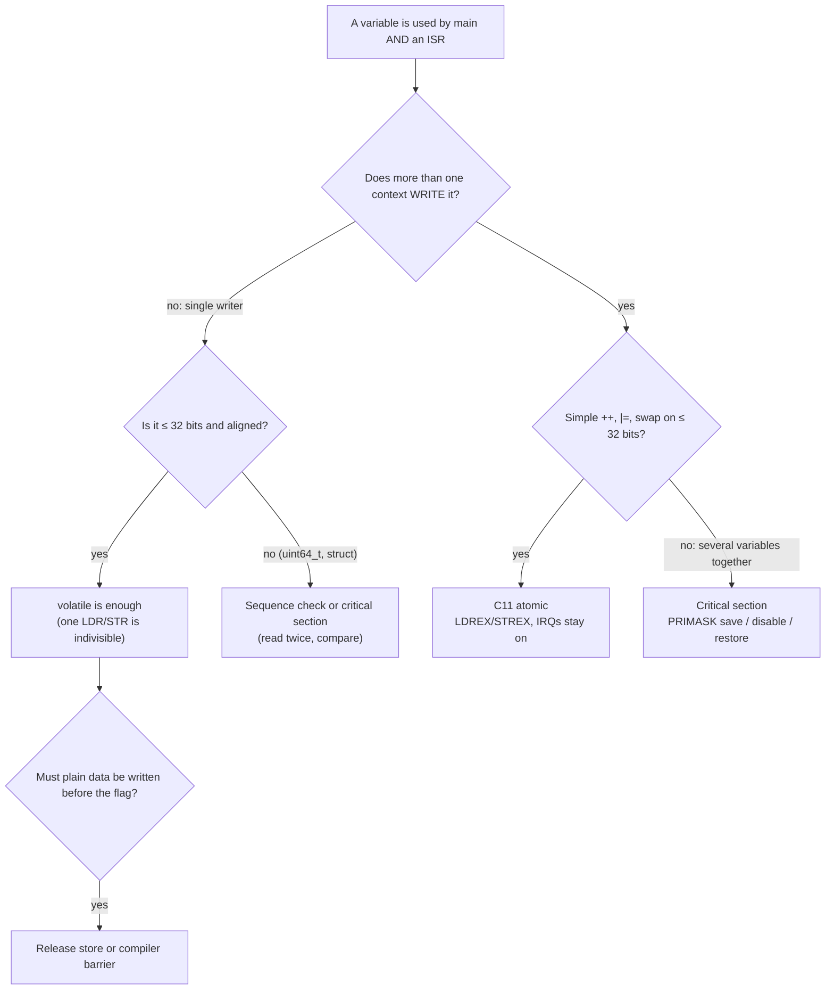

## Learning objectives

By the end of this lesson you will be able to:

1. **Explain** the *as-if rule*: what the compiler may legally remove, merge or reorder, and why a program that works at `-O0` can hang at `-O2`.
2. **Decide** exactly which objects must be `volatile`: memory-mapped registers, variables shared with an ISR, variables changed by DMA, and locals that survive `setjmp`. Also decide which must **not** be.
3. **Prove** that `volatile` is not atomic, measure the lost updates on the board, and fix them with a critical section or a C11 atomic (`LDREX`/`STREX`).
4. **Place** data deliberately in Flash or RAM with `const`, read any declaration mixing `const`, `volatile` and `*` from right to left, and design `const`-correct driver APIs.
5. **Distinguish** a *compiler* barrier from a *hardware* barrier (`DMB`, `DSB`, `ISB`), and know when each is needed on a Cortex-M4.
6. **Read** the disassembly that proves each of the above, and recognise the telltale `b .` (branch to itself) of a hoisted loop.

## Why this matters

A motor-controller team ships a firmware update. Their only change is switching the build from *Debug* to *Release* to gain 30 % speed. On the first power-up after the update, the board freezes during calibration, every time.

The calibration waits for the ADC's end-of-conversion interrupt:

```c
static bool s_adcDone;                 /* set to true in ADC_IRQHandler */

void adc_calibrate(void)
{
    s_adcDone = false;
    ADC1->CR2 |= ADC_CR2_SWSTART;
    while (!s_adcDone) { }             /* works at -O0, hangs at -O2 */
}
```

The interrupt fires. The ISR writes `true` to RAM. But at `-O2` the compiler has turned the loop into *"read `s_adcDone` once, then spin forever"*. That's legal C: nothing in the loop can change the variable **as far as C knows**. The fix is one keyword. The time lost in the field is weeks.

This lesson is about the two qualifiers that describe what the C language can't see: `volatile` (*something outside this code changes or observes this object*) and `const` (*this code will not write it*). You'll need them in:
- every register access (A0.4, A0.5) and every CMSIS header,
- ISR/main communication (A6.5), timer flags (A7.2), UART ring buffers (A8.4) and DMA buffers (A12.3),
- Flash layout and bootloaders (A14.2), fault handlers (A15.2),
- FreeRTOS: mutexes, task notifications and interrupt-safe APIs (B5.1, B7.1, B10.2).

## Concept explanation

````layer beginner
### The compiler is allowed to cheat

Your C file describes a program for an imaginary computer called the **abstract machine**. The C standard only requires the real program to produce the same **observable behaviour**: the same output, and the same accesses to `volatile` objects. Everything else is fair game. This is called the **as-if rule**.

```callout analogy title="Analogy: the delivery driver"
You give a driver a list: *"Go to the bakery. Check if the bread is ready. If not, check again. Repeat."* A smart driver thinks: *"Nobody else goes into that bakery, so if the bread isn't ready now it never will be."* He checks once and waits outside forever. That's the optimiser. `volatile` is you writing on the list: **"Someone else bakes the bread. Go inside and look every single time."**
```

So at `-O2` the compiler will happily:
- keep a variable in a CPU register instead of re-reading it from RAM,
- delete a loop that "does nothing",
- merge two writes to the same variable into one,
- move a write earlier or later.

That's great for normal variables, and exactly wrong for:
1. **Hardware registers**: `USART2->SR` changes when a byte arrives, and writing `USART2->DR` sends a byte. Every read and every write matters.
2. **Variables shared with an interrupt**: the ISR changes them "behind main's back".

### `volatile`: "look every time"

Declaring an object `volatile` tells the compiler: *every read and write I wrote must really happen, in the order I wrote it, with no caching in registers.*

```c
static volatile bool s_adcDone;   /* now the loop re-reads RAM on every iteration */
```

Step through what the compiler actually generates, with and without `volatile`:

```anim
optimizer-hoist
```

CMSIS has already done this for every register: `__IO` is `#define __IO volatile`. That's why `while ((USART2->SR & USART_SR_TXE) == 0U) { }` works at every optimisation level.

### `volatile` does **not** mean "safe"

`volatile` makes each access happen, but `count++` is still three separate steps: read, add, write. An interrupt can arrive between the read and the write, and one of the two increments is lost:

```anim
volatile-not-atomic
```

You'll measure this on the board in the lab: hundreds of lost counts per run, even though the variable is `volatile`.

### `const`: "I won't write it"

`const` is a promise that **your code** won't modify an object. The compiler holds you to it (writing a `const` object is a compile error), and in return it can put the object in **Flash** instead of RAM. The STM32F446 has 512 KB of Flash but only 128 KB of SRAM, so this matters:

```c
static const uint16_t k_sineTable[256] = { /* … */ };   /* 512 B of Flash, 0 B of RAM */
static       uint16_t s_sineTable[256] = { /* … */ };   /* 512 B of RAM AND 512 B of Flash */
```

Without `const`, the table lives in RAM, and a copy of its initial values *also* lives in Flash so the startup code can copy it into RAM at reset. You pay twice.
````

````layer intermediate
### What `volatile` guarantees, exactly

C11 §5.1.2.3 and §6.7.3 say that an access to a `volatile` object is a **side effect**, the same as I/O. So the compiler must:

| Guarantee | Example |
|---|---|
| Perform **every** read and write in the source | `while (!(SR & TXE))` reloads `SR` each time |
| Perform **no extra** accesses | a read of `USART2->DR` (which clears `RXNE`) happens exactly once |
| Keep volatile accesses in **program order relative to each other** | `CR1 = …; CR2 = …;` are written in that order |
| Not merge or split them, for naturally-sized objects | two stores stay two stores; a `uint32_t` is one `STR` |

And it guarantees **nothing** about:

| Not guaranteed | Consequence |
|---|---|
| **Atomicity** | `v++`, `v \|= m`, `v = v + 1` are read-modify-write sequences an ISR can split |
| **Ordering of non-volatile accesses** around it | the compiler may move a plain buffer write after your volatile "ready" flag |
| **Hardware ordering** | a store can still sit in the CPU's write buffer after the instruction completes |
| **Anything on multi-core or cached systems** | volatile emits no `DMB` and no cache maintenance |

### When you need `volatile`

| Object | `volatile`? | Why |
|---|---|---|
| Peripheral register | **Yes** (CMSIS does it: `__IO`, `__I`, `__O`) | Hardware reads and writes it |
| Variable written by an ISR, read by main (or the reverse) | **Yes** | Another context changes it |
| Buffer written by DMA and read by the CPU | **Yes**, *plus* a barrier/cache rule (A12.3) | The DMA controller writes it |
| Local that is modified between `setjmp` and `longjmp` | **Yes** (C11 §7.13.2.1) | Its register copy may be restored stale |
| A loop counter, "to make a delay work" | **No**. Use a timer (A7) or the DWT cycle counter | The delay length still depends on flags, Flash wait states and interrupts |
| Variable shared between two FreeRTOS tasks | **Not enough**: use a mutex, queue or notification (B4, B5) | The RTOS primitives include the needed barriers |
| Every global, "just in case" | **No** | It disables optimisation and hides real races |

### `volatile` is not atomic: the three fixes

On a single-core Cortex-M, a read-modify-write shared with an ISR has three standard fixes:

1. **Single writer.** Only one context ever *writes* the variable, and the others only read it. An aligned 32-bit load or store is a single, indivisible bus access on Cortex-M (ARMv7-M ARM §A3.5.3, *single-copy atomicity*). So a counter incremented **only** in the ISR and read in main is safe. This is the cheapest design.
2. **Critical section.** Disable interrupts around the read-modify-write:

   ```c
   uint32_t primask = __get_PRIMASK();   /* were interrupts already off?  */
   __disable_irq();                      /* CPSID i                      */
   s_shared++;                           /* LDR / ADD / STR, uninterrupted */
   __set_PRIMASK(primask);               /* restore, don't blindly enable */
   ```

   Keep it a few instructions long: every cycle here adds latency to **every** interrupt.
3. **C11 atomics** (`<stdatomic.h>`). On Cortex-M3/M4/M7, 8-, 16- and 32-bit atomics are **lock-free**, and GCC implements `atomic_fetch_add` with `LDREX`/`STREX`: interrupts stay enabled, and the update retries if it was interrupted. (Cortex-M0/M0+ have no `LDREX`, so GCC calls library functions there, usually implemented with a critical section.)

The lab measures fixes 1 and 3 side by side.

### Reading declarations: right to left

`const` and `volatile` (together, *cv-qualifiers*) apply to whatever is immediately to their **left**, or to the right if nothing is on their left. Read the declaration from the name outwards, right to left:

| Declaration | Read as | Can change `*p`? | Can change `p`? |
|---|---|---|---|
| `const uint8_t *p` | p is a pointer to a const uint8_t | no | yes |
| `uint8_t const *p` | the same thing | no | yes |
| `uint8_t *const p` | p is a const pointer to a uint8_t | yes | no |
| `const uint8_t *const p` | a const pointer to a const uint8_t | no | no |
| `volatile uint32_t *p` | pointer to a volatile register | — | yes |
| `uint32_t *volatile p` | a volatile pointer (changed by an ISR) to plain data | — | — |
| `const volatile uint32_t *p` | pointer to a **read-only register** (CMSIS `__I`) | no, but hardware can | yes |

`const volatile` isn't a contradiction. It means *"I may not write it, but it changes by itself"*: that's an input data register, or a status register.

### Where `const` data lives

The STM32CubeIDE linker script (`STM32F446RETX_FLASH.ld`) sends each section to a memory:

| Section | Holds | Memory | Paid at reset |
|---|---|---|---|
| `.text` | code | Flash | — |
| `.rodata` | `const` objects with static storage, string literals | **Flash** | — |
| `.data` | initialised non-const variables | **RAM**, plus an image in Flash | copied by `Reset_Handler` |
| `.bss` | zero-initialised variables | **RAM** | zeroed by `Reset_Handler` |
| stack | locals, including `const` locals | **RAM** | — |

```anim
const-placement
```

Three rules come out of that table:
- `const` only moves an object to Flash when it has **static storage** (file scope, or `static` inside a function). A `const` *local* array is rebuilt on the stack at every call.
- For tables of strings, write **both** consts: `static const char *const k_names[]`. Otherwise the pointer array is writable and lands in RAM.
- Reading Flash costs wait states at high clock speed (5 at 180 MHz, A4.4). The F4's ART accelerator hides most of that for code and small tables. For a hot, large table that is read randomly, a RAM copy can be faster. That's a deliberate trade, not an accident.

### `const` is not a constant in C

Unlike C++, a `const` variable in C is **not** an *integer constant expression*. GCC 10.3 rejects both of these:

```c
const int N = 16;
int buffer[N];            /* error: variably modified 'buffer' at file scope */
switch (x) { case N: … }  /* error: case label does not reduce to an integer constant */
```

For compile-time constants use `enum { N = 16 };` or `#define N (16U)` (A0.6 compares the two).

### `const`-correct APIs

`const` in a parameter is documentation that the compiler enforces:

```c
size_t uart_send(USART_TypeDef *uart, const uint8_t *data, size_t len);  /* won't modify data */
uint32_t crc32(const void *data, size_t len);
```

A caller can pass a `const` table from Flash straight to these functions. If the parameter were `uint8_t *`, the caller would have to cast the `const` away, which hides real bugs. Writing through a pointer whose `const` you cast away is **undefined behaviour** when the object really is `const` (C11 §6.7.3p6). On an STM32 that object is in Flash, and the write simply doesn't happen.

### Reading the documentation

- In CMSIS `core_cm4.h`: `#define __I volatile const`, `#define __O volatile`, `#define __IO volatile`, and the `__IM`/`__OM`/`__IOM` variants for struct members. Every register struct uses them.
- In the reference manual, a register marked **r** maps to `__I`/`__IM`, and one marked **w** to `__O`. Writing an `__I` member is a compile error, which is a free check against the RM.
````

````layer advanced
### What the lab compiles to (GCC 10.3, `-O2`, verified with `objdump`)

**Plain flag.** The load is hoisted above the loop, and the loop only reads the cycle counter (itself volatile). Once the flag reads 0, the function can only leave through the timeout:

```armasm title="wait_flag_plain, -O2: s_flagPlain is read exactly once (ldrb r4)"
    ldrb   r4, [r2, #0]      @ s_flagPlain, loaded ONCE
    ldr    r2, [r3, #4]
    ldr    r1, [r2, #0]      @ start = *cycleCounter
    cbnz   r4, done
loop:
    ldr    r3, [r2, #0]      @ *cycleCounter (volatile): reloaded
    subs   r3, r3, r1
    cmp    r3, r0
    bcc.n  loop              @ no load of the flag in here
done:
    mov    r0, r4
```

Without the timeout, the result is the textbook symptom, a branch to itself:

```armasm title="while (!s_flag) { } with a plain bool, -O2"
    ldrb   r3, [r3, #0]
    cbnz   r3, 28
26: b.n    26                @ "b ." : spin forever
28: bx     lr
```

**Empty delay loop.** `spin_plain()` isn't just emptied: the loop has no effect, so the function has none, and GCC deleted the **call** as well. No `.text.spin_plain` section exists in the object file. `spin_volatile()` keeps a load and a store of `i` on the stack at every iteration (`ldr`/`adds`/`str`/`ldr`/`cmp`/`bls`).

**Counters.** `count_volatile()` is `ldr r3,[r1]` · `add r3,#1` · `str r3,[r1]` inside the loop: a three-instruction window. `count_atomic()` is:

```armasm title="atomic_fetch_add_explicit(&s, 1U, memory_order_relaxed)"
retry:
    ldrex  r1, [r2]          @ load and arm the exclusive monitor
    adds   r1, #1
    strex  r0, r1, [r2]      @ store only if still armed; r0 = 0 ok, 1 failed
    cmp    r0, #0
    bne.n  retry
```

The Cortex-M4 clears its exclusive monitor on **any exception entry or exit** (Cortex-M4 Generic User Guide, *LDREX and STREX*). So if an ISR runs between `LDREX` and `STREX`, the `STREX` fails and the loop retries. That's why no interrupt needs to be disabled.

With `memory_order_acquire`/`release` instead of `relaxed`, GCC 10.3 adds a `DMB ISH` next to the access (verified in the ring-buffer solution). That costs a few cycles, and on a single-core M4 without a cache only the *compiler* ordering is strictly required, but it keeps the code correct if it's ever moved to a multi-core part.

**Plain counter, for comparison.** `for (i = 0; i < n; i++) s_cnt++;` on a *non*-volatile `s_cnt` compiles to a single `add r0, r0, r3` / `str`: the loop is gone, and the ISR's increments during that time would be overwritten in one go.

### Compiler barriers vs hardware barriers

Two different things are called "barrier":

| | Stops | Emits | Use for |
|---|---|---|---|
| **Compiler barrier** `__asm volatile("" ::: "memory")` (CMSIS 5: `__COMPILER_BARRIER()`) | the **compiler** from caching or moving memory accesses across it | nothing | ordering plain data around a flag in single-core code |
| `DMB` (`__DMB()`) | the **CPU** from reordering memory accesses across it | 1 instruction | DMA descriptors, multi-core, shared memory |
| `DSB` (`__DSB()`) | execution until all outstanding memory accesses **complete** | 1 instruction | before `WFI`, after a write that must take effect (e.g. flag clear, `VTOR`, MPU) |
| `ISB` (`__ISB()`) | fetching instructions until the pipeline is flushed | 1 instruction | after changing `CONTROL`, `PRIMASK` side effects, relocated code |

Verified: adding `__asm volatile("" ::: "memory");` inside `while (!s_flag)` makes GCC reload the plain flag on every iteration (`ldrb` · `cmp` · `beq`). It fixes *this* loop, but `volatile` on the variable is the correct and self-documenting fix. A barrier protects one place; the qualifier protects every access.

The CMSIS intrinsics `__disable_irq()`, `__enable_irq()`, `__DMB()`, `__DSB()` and `__ISB()` all include a `"memory"` clobber, so they're compiler barriers too.

### Volatile doesn't order your plain data

```c
static uint8_t       s_frame[8];
static volatile bool s_frameReady;

s_frame[0] = cmd;         /* plain store           */
s_frameReady = true;      /* volatile store         */
```

C only orders volatile accesses *among themselves*. The compiler may legally sink the `s_frame` store below the flag. The ISR then sees `s_frameReady` before the data is there. GCC rarely does it for code this simple, which is exactly why the bug survives code review. Fix it with a release store (`atomic_store_explicit(&ready, true, memory_order_release)`), a compiler barrier between the two, or by making the buffer `volatile` too (slow, and easy to forget).

### The ISR that runs twice: clearing a flag at the end

```c
void TIM6_DAC_IRQHandler(void)
{
    do_work();
    TIM6->SR = ~TIM_SR_UIF;    /* last instruction before return */
}
```

The store goes through the CPU's write buffer and the AHB/APB bridge, which takes a few cycles. The exception return can complete **before** the write reaches TIM6. The NVIC still sees the interrupt line active, and immediately re-enters the handler. Symptoms: every interrupt counted twice, or a handler that "randomly" runs with no flag set. Fixes: clear the flag **first** (as the lab does), or put `__DSB()` after the clear. `volatile` can't help here: it guarantees the store instruction is executed, not that the peripheral has received it.

### Access width and volatile

`volatile` also freezes the **width** of each access. `*(volatile uint8_t *)&GPIOA->IDR` compiles to `LDRB` (verified), a byte read of a peripheral. Most STM32 peripherals accept byte and half-word accesses, but some registers don't, and some FIFOs behave differently by width (A9.2: `SPI_DR` accessed as 8 bits sends 8 bits). Use the register's own type.

Volatile **bit-fields** on ARM obey `-fstrict-volatile-bitfields` (the AAPCS default): an assignment to a 2-bit field of a `volatile uint32_t` bit-field is `LDR` · `BFI` · `STR` (verified). A read-modify-write of the whole word, invisible at the call site. That's one reason CMSIS uses masks (A0.2, A0.5).

### DMA and caches

On the Cortex-M4 there's no data cache: a buffer written by DMA is visible to the CPU as soon as the transfer-complete flag is set, provided the compiler actually reloads it (volatile or a barrier). On a Cortex-M7 (STM32F7/H7), the CPU may read **stale cache lines**, and no C qualifier fixes that: you need cache clean/invalidate (`SCB_InvalidateDCache_by_Addr`) or a non-cacheable MPU region (A12.3).

### `const` and the linker, in detail

In the object file of this lab (`arm-none-eabi-objdump -h vc_lab.o`, with `-fdata-sections`):

| Symbol | Section | Size |
|---|---|---|
| `k_table` | `.rodata.k_table` | 0x40 |
| `k_names` | `.rodata.k_names` | 0x0C |
| `s_names` | **`.data.s_names`** | 0x0C |
| `s_table` | `.data.s_table` | 0x40 |
| `s_zeroTable` | `.bss.s_zeroTable` | 0x40 |
| `localConst` template | `.rodata` | 0x10, copied to the stack at each call |

The linker script then places `.rodata*` in `FLASH`, and `.data*` in `RAM AT> FLASH`. The `AT> FLASH` is what creates the second copy: the *load address* (LMA) is in Flash and the *run address* (VMA) is in RAM. `Reset_Handler` copies from `_sidata` to `_sdata`…`_edata` and zeroes `_sbss`…`_ebss` (A2.3 walks through the startup code).
````

## Under the hood

### Registers and addresses used in this lesson

| Register | Address | Access | Used for |
|---|---|---|---|
| `SCB_CPUID` | `0xE000 ED00` | r (`__IM`) | Read-only CPU identity: **0x410FC241** on the STM32F446 (Arm, Cortex-M4 `0xC24`, r0p1) |
| `DWT_CYCCNT` | `0xE000 1004` | rw | Free-running cycle counter, our clock for every measurement |
| `CoreDebug_DEMCR` | `0xE000 EDFC` | rw | Bit 24 `TRCENA` must be 1 before the DWT counts |
| `RCC_APB1ENR` | `0x4002 3840` | rw | Bit 4 `TIM6EN`, bit 17 `USART2EN` |
| `TIM6_CR1` | `0x4000 1000` | rw | Bit 0 `CEN`: counter enable |
| `TIM6_DIER` | `0x4000 100C` | rw | Bit 0 `UIE`: update interrupt enable |
| `TIM6_SR` | `0x4000 1010` | **rc_w0** | Bit 0 `UIF`: cleared with `SR = ~UIF` (A0.2) |
| `TIM6_EGR` | `0x4000 1014` | w | Bit 0 `UG`: reload `PSC`/`ARR` now (and set `UIF`) |
| `TIM6_PSC` / `TIM6_ARR` | `0x4000 1028` / `0x4000 102C` | rw | 16 MHz / (0 + 1) / (799 + 1) = **20 kHz** |
| NVIC `TIM6_DAC_IRQn` | IRQ **54** | — | `NVIC_EnableIRQ()` sets bit 22 of `ISER1` |

### The memory map the lab checks against

| Region | Range | Size on the F446RE |
|---|---|---|
| Flash (main memory) | `0x0800 0000` – `0x0807 FFFF` | 512 KB |
| System memory (ROM bootloader) | `0x1FFF 0000` – `0x1FFF 77FF` | 30 KB |
| SRAM1 + SRAM2 | `0x2000 0000` – `0x2001 FFFF` | 112 + 16 KB |
| Peripherals | `0x4000 0000` – `0x5FFF FFFF` | — |
| Cortex-M4 private peripherals (SCB, NVIC, DWT) | `0xE000 0000` – `0xE00F FFFF` | — |

The initial stack pointer is `_estack = 0x2002 0000` (the end of SRAM), so locals appear at addresses just below it.

### Deciding: volatile, atomic, or a lock?



### What to read

| Document | Section | Why |
|---|---|---|
| ISO C11 (N1570) | §5.1.2.3 *Program execution* (as-if rule), §6.7.3 *Type qualifiers*, §7.17 `<stdatomic.h>` | The rules themselves |
| GCC manual | *When is a Volatile Object Accessed?*; *Extended Asm → Clobbers* (`"memory"`); `-fstrict-volatile-bitfields` | What GCC does in practice |
| Cortex-M4 Devices Generic User Guide (DUI 0553) | *LDREX/STREX*, *CLREX*, *DMB/DSB/ISB*, *Memory model → Synchronization primitives* | Exclusive monitor and barriers |
| ARMv7-M Architecture Reference Manual (DDI 0403) | §A3.5.3 *Atomicity in the ARM architecture*; §A3.7 *Memory barriers* | Which accesses are indivisible |
| Arm AN321, *ARM Cortex-M Programming Guide to Memory Barrier Instructions* | whole note | When M3/M4 really need `DSB`/`ISB` |
| RM0390 | *Basic timers (TIM6/TIM7)*; *Memory map* | Timer registers and the regions checked in T4 |
| STM32CubeIDE linker script `STM32F446RETX_FLASH.ld` | `.rodata`, `.data`, `.bss` output sections | Where each section goes |

## Hands-on lab: the optimiser bench

**Goal:** make the compiler's cheating visible on real silicon. A 20 kHz timer interrupt plays "the outside world". Four tests run each bug next to its fix:

- **T1**: a flag set by the ISR, plain vs `volatile`.
- **T2**: a busy-wait delay loop, plain vs `volatile` counter.
- **T3**: `count++` from main and the ISR, `volatile` vs C11 atomic. Lost updates are counted.
- **T4**: the address of each kind of object, checked against the Flash/SRAM map.

You'll run the same binary in **Debug (`-O0`)** and **Release (`-O2`)** and compare.

**No wiring needed:** LD2 (PA5) and the USART2 Virtual COM Port, as in A0.1.

### Step 1: CubeMX configuration (HAL version)

Start from the A0.1/A0.2 project (copy it and rename it `A0_3_VolatileLab`), or create a new NUCLEO-F446RE project with the default peripherals. Then:

1. **Clock**: HSI, HCLK = **16 MHz**, APB1/APB2 **/1** (as in A0.1). TIM6 is on APB1, so its clock is 16 MHz.
2. **Timers → TIM6**: tick **Activated**. Parameter Settings: Prescaler **0**, Counter Mode Up, Counter Period **799**, auto-reload preload **Disable**.
   *Why:* 16 MHz / (0 + 1) / (799 + 1) = **20 kHz**, an interrupt every 800 cycles. That's frequent enough to hit a three-instruction window hundreds of times per test.
3. **TIM6 → NVIC Settings**: enable **TIM6 global interrupt, DAC1 and DAC2 underrun error interrupts**. Leave the priority at 0. It must be allowed to preempt main, which it is by default.
4. **PA5**: `GPIO_Output`, label **`LD2`**. **USART2**: Asynchronous, 115200 8N1.
5. **Warnings**: `-Wall -Wextra -Wconversion -Wsign-conversion -Wshadow`. Generate code.
6. **Two build configurations**: CubeIDE already has *Debug* (`-O0`) and *Release* (`-Os`). For this lab, set Release to **`-O2`**: *Project → Properties → C/C++ Build → Settings → (Configuration: Release) → MCU GCC Compiler → Optimization → Optimize more (-O2)*.

CubeMX generates `TIM6_DAC_IRQHandler()` in `stm32f4xx_it.c`, which calls `HAL_TIM_IRQHandler(&htim6)`. That in turn calls our `HAL_TIM_PeriodElapsedCallback()`.

### Step 2: add the lab files

`vc_lab.c` contains every test and no hardware code. The platform (console, cycle counter, fast tick, memory map) is injected, as in A0.1, so the same file runs on the board and on a PC.

```c file=A0.3/Core/Inc/vc_lab.h
```

```c file=A0.3/Core/Src/vc_lab.c
```

### Step 3: HAL `main.c`

```c file=A0.3/Core/Src/main.c
```

### Step 4: register-level version

Create an **Empty** project as in A0.1 (copy `Drivers/CMSIS`, add the include paths, define `STM32F446xx`). Add `vc_lab.h`/`vc_lab.c` and this `main.c`. Here the ISR is ours: `TIM6_DAC_IRQHandler` is the name the startup file's vector table already uses, so defining it replaces the weak default handler.

```c file=A0.3/Core/Src/main_reg.c
```

### Step 5 (optional): on your PC

A second thread plays the hardware: it increments a counter (our "cycle counter") and calls `VcLab_TickIsr()` every 4096 counts while the tick is enabled.

```c file=A0.3/host/host_main.c
```

```bash title="PC build (MinGW / Linux / macOS), try both -O0 and -O2"
gcc -std=c11 -O2 -Wall -Wextra -pthread -ICore/Inc host/host_main.c Core/Src/vc_lab.c -o vc_lab
./vc_lab
```

Strictly speaking, sharing a plain variable between two threads is a *data race*, which is undefined behaviour in C11. On the PC we use it on purpose, to show the same failure. On the MCU, the ISR case is covered by the same rules: `volatile` for visibility, atomics or a lock for read-modify-write.

### Line-by-line: the non-obvious lines

| Line | Explanation |
|---|---|
| `static bool s_flagPlain;` | The bug under test. Written only in `VcLab_TickIsr()`, read in a loop in `wait_flag_plain()`. Nothing tells the compiler those run concurrently. |
| `#define NOINLINE __attribute__((noinline))` | Keeps each test in its own function, so you can find it in the disassembly and the measurement isn't blended into `VcLab_Run()`. It does **not** stop GCC from deleting a call to a function with no effect: `spin_plain()` still vanishes. |
| `const volatile uint32_t *cycleCounter;` | A pointer to a register we only read and the hardware changes: `const volatile`, exactly CMSIS's `__IM`. `&DWT->CYCCNT` (an `__IOM`, i.e. `volatile uint32_t`) converts to it implicitly, because adding a qualifier is always allowed. |
| `while (!s_flagPlain) { if ((now_cycles() - start) >= timeoutCycles) … }` | The timeout reads a volatile counter, so the loop can still exit. Without it, the Release build would hang in T1, which is realistic but makes a poor lab. |
| `for (volatile uint32_t i = 0U; i < loops; i++)` | The volatile loop counter survives optimisation, but its speed depends on the compiler and on Flash wait states. It proves a point; it's not a delay routine. `delay_ms()` in `main_reg.c` is the right way. |
| `atomic_fetch_add_explicit(&s_sharedAtomic, 1U, memory_order_relaxed)` | Relaxed is enough for a counter: we need the increment to be indivisible, not ordered against other data. It compiles to the `LDREX`/`STREX` loop. |
| `const uint32_t volatileLost = volatileExpected - s_sharedVolatile;` | Every increment by main and by the ISR should be counted. The tick is stopped before this line, so nothing changes while we compute. |
| `static const char *const k_names[]` vs `static const char *s_names[]` | Same strings, one extra `const`. T4 shows the first array in Flash and the second in SRAM. |
| `const uint32_t localConst[4]` | A `const` local lives on the stack. T4 prints an address just below `0x2002 0000`. |
| `TIM6->EGR = TIM_EGR_UG;` then `TIM6->SR = ~TIM_SR_UIF;` | `UG` loads the prescaler immediately, and sets `UIF` as a side effect. Clearing it before `NVIC_EnableIRQ` avoids a spurious first interrupt. |
| `TIM6->SR = ~TIM_SR_UIF;` as the **first** line of the ISR | Clearing at the start leaves the whole handler's duration for the write to reach the timer, so the interrupt can't re-trigger on exit (advanced layer). |
| `__DSB(); __ISB();` in `fast_tick(false)` | `DSB` waits until the `CEN = 0` write has reached TIM6. `ISB` makes sure an interrupt that was already pending is taken right here, before the test reads its counters, not in the middle of that. |
| `.cpuid = &SCB->CPUID` | `SCB->CPUID` is declared `__IM uint32_t`. Try `SCB->CPUID = 0;`: the compiler refuses (*assignment of read-only member*). |

### Step 6: run and verify

1. Build **both** configurations. Expect **0 warnings**: the lab files were compiled with GCC 10.3 (`-mcpu=cortex-m4 -mfloat-abi=hard`) and the flags above, at `-O0` and `-O2`.
2. Open the VCP at 115200 8N1, flash the **Debug** build, press **RESET**.
3. Flash the **Release** build, press **RESET**, and compare.

Expected output on the STM32, **Release (`-O2`)**. Cycle counts, ISR counts and addresses vary; the pattern doesn't.

```console title="USART2 @ 115200 — Release (-O2)"
=== A0.3 volatile & const lab ===
[T0] Build: optimised (-O1 or higher)
     CPUID = 0x410FC241 (implementer 0x41, part 0xC24, r0p1)
[T1] ISR flag    plain=TIMEOUT volatile=seen (ISR ran ≈1000 times)
      -> PASS
[T2] delay loop  plain=<a few> cycles, volatile=<≈1 000 000> cycles (100000 loops)
      -> PASS
[T3] volatile++  expected=<200000 + ISR count> lost=<hundreds> (<N> cycles)
     atomic++    expected=<200000 + ISR count> lost=0 (<N> cycles)
      -> PASS
[T4] Where does it live?
     static const uint32_t k_table  0x0800xxxx  Flash
     static uint32_t s_table = {1}  0x2000xxxx  SRAM
     static uint32_t s_zeroTable    0x2000xxxx  SRAM
     "idle" (string literal)        0x0800xxxx  Flash
     const char *s_names[]          0x2000xxxx  SRAM
     const char *const k_names[]    0x0800xxxx  Flash
     const uint32_t localConst[]    0x2001Fxxx  SRAM
     function test_const_placement  0x0800xxxx  Flash
      -> PASS
=== ALL PASS ===
```

**LD2 blinks at 1 Hz** when every fixed variant passed, 5 Hz otherwise.

The same lab on a PC (x86-64, MinGW GCC 12, real run), for comparison:

```console title="PC — gcc -O0"
[T0] Build: not optimised (-O0)
[T1] ISR flag    plain=seen volatile=seen (ISR ran 1 times)
[T2] delay loop  plain=70093 cycles, volatile=72083 cycles (100000 loops)
[T3] volatile++  expected=200029 lost=27 (119664 cycles)
     atomic++    expected=200076 lost=0 (313568 cycles)
```

```console title="PC — gcc -O2"
[T0] Build: optimised (-O1 or higher)
[T1] ISR flag    plain=TIMEOUT volatile=seen (ISR ran 4770 times)
[T2] delay loop  plain=0 cycles, volatile=100983 cycles (100000 loops)
[T3] volatile++  expected=200045 lost=44 (184194 cycles)
     atomic++    expected=200176 lost=0 (724325 cycles)
```

What to notice:
- **T1:** at `-O0` the plain flag works. At `-O2` it times out while the ISR ran about a thousand times. Same source code, same hardware.
- **T2:** at `-O0` both loops take time. At `-O2` the plain loop costs nothing, because it no longer exists.
- **T3:** lost updates in **both** builds. Optimisation doesn't cause this bug and debugging doesn't hide it. The atomic version never loses a count. It's slower, but only on this worst-case loop that does nothing else.
- **T4:** the two string tables differ only by one `const`, and land in different memories.

**Fill in this table from your board:**

| Build | T1 plain | T2 plain cycles | T2 volatile cycles | T3 lost (volatile) | T3 cycles volatile / atomic |
|---|---|---|---|---|---|
| Debug (`-O0`) | | | | | |
| Release (`-O2`) | | | | | |

**Look at it in the debugger:**
- Release build: set a breakpoint in `wait_flag_plain`, open **Disassembly**, and find the `ldrb` *before* the loop. Step through the loop: `s_flagPlain` in the *Expressions* view turns `true` (the debugger reads RAM), while the loop keeps running on the stale register.
- *Window → Show View → Build Analyzer → Memory Details*: find `k_table` under `FLASH` and `s_table` under `RAM`. The `.data` line shows its load address in Flash too.

## Common mistakes & debugging

### 1. ISR flag without `volatile`
- **Symptom:** works in Debug, hangs in Release; or works until an unrelated edit changes inlining.
- **Cause:** the load was hoisted out of the loop. In the disassembly: a `b .` or a loop with no load of the flag.
- **Fix:** `static volatile bool s_flag;`.

### 2. `volatile` counter incremented in main and in an ISR
- **Symptom:** statistics that drift, a reference count that never reaches zero, a ring buffer that very occasionally loses a byte.
- **Fix:** a single writer; or a C11 atomic; or a short `PRIMASK` critical section.

### 3. Delay loop "fixed" with `volatile`
- **Symptom:** the delay changes length with the clock, the optimisation level, the Flash wait states or the compiler version.
- **Fix:** a timer, `HAL_Delay()`, or a DWT-based `delay_cycles()` like `delay_ms()` in `main_reg.c`.

### 4. `volatile` in the wrong place
- **Symptom:** `uint32_t *volatile reg = …;` still gets optimised: the *pointer* is volatile, not the register it points to.
- **Fix:** `volatile uint32_t *reg` (read right to left: pointer to volatile uint32_t).

### 5. A large table without `const`
- **Symptom:** the linker reports `region 'RAM' overflowed`, or the stack collides with `.bss` at run time, after adding a font or a sine table.
- **Fix:** `static const`. Check the Build Analyzer: the table must move from RAM to FLASH.

### 6. String table with a single `const`
- **Symptom:** `const char *names[]` costs RAM (4 bytes per entry, plus the Flash copy of those pointers).
- **Fix:** `const char *const names[]`.

### 7. A large `const` local array
- **Symptom:** stack overflow, or a function that is mysteriously slow: the array is copied onto the stack at each call.
- **Fix:** `static const` inside the function.

### 8. Casting `const` or `volatile` away
- **Symptom:** a write through `(uint8_t *)constPtr` does nothing (the data is in Flash), or an access through `(uint32_t *)&REG` gets optimised away.
- **Fix:** never cast qualifiers away. If an API forces you to, the API is wrong: fix its signature.

### 9. Clearing the interrupt flag as the last line of the ISR
- **Symptom:** the ISR runs twice per event, or runs with no flag set.
- **Fix:** clear first, or add `__DSB()` after the clear.

### 10. Plain data written after its volatile flag
- **Symptom:** the consumer sometimes reads the previous frame's data.
- **Fix:** write the data, then a release store (or a compiler barrier), then the flag. See Exercise 🟡.

## Best practices & production tips

```callout production title="How professional teams use volatile and const"
- **Every ISR-shared variable is declared `volatile` and documented with its writer**: `/* written by USART2_IRQHandler only */`. Reviews check both.
- **Prefer single-writer designs.** A counter owned by one ISR and only read elsewhere needs no lock at all.
- **Keep critical sections to a few instructions**, save and restore `PRIMASK` rather than blindly calling `__enable_irq()`, and never call a blocking function inside one.
- **Use C11 atomics for counters and flags** shared between contexts on M3/M4/M7. On M0/M0+, check what the toolchain generates first.
- **Never "fix" a race by adding `volatile` everywhere.** It makes the code slower and the race is still there.
- **`const` by default**: parameters (`const uint8_t *data`), lookup tables (`static const`), string tables (`const char *const`). MISRA C:2012 rule 8.13 asks for exactly this.
- **Watch the map file** (`.map`) and the Build Analyzer in CI: fail the build if `.data` + `.bss` grow unexpectedly.
- **Test the Release build**, on target, from the first week. "It works in Debug" is not a test result.
- **Look at the disassembly** of every busy-wait and every ISR handshake the first time you write it. It takes one minute.
```

## Quiz

```quiz
[
  {
    "q": "`static bool done;` is set to true in an ISR. `while (!done) { }` in main() hangs at -O2 but works at -O0. Why?",
    "options": ["The ISR never runs at -O2", "The compiler loaded `done` once before the loop, because nothing in the loop can change it as far as C knows", "bool is not atomic on Cortex-M", "-O2 disables interrupts"],
    "answer": 1,
    "why": "Under the as-if rule, a non-volatile object can be cached in a register. The ISR writes RAM, but the loop never reads RAM again. `volatile bool done;` forces a load on every iteration."
  },
  {
    "q": "`volatile uint32_t count;` is incremented with `count++` in main() and in a timer ISR. Which statement is true?",
    "options": ["volatile makes the increment atomic, so no update is lost", "Updates can be lost: count++ is LDR, ADD, STR and the ISR can run between the LDR and the STR", "Updates are only lost at -O2", "The Cortex-M4 increments memory in a single instruction"],
    "answer": 1,
    "why": "volatile guarantees that each load and store is performed, not that the three are indivisible. Fixes: single writer, a critical section, or `atomic_fetch_add` (LDREX/STREX)."
  },
  {
    "q": "Which declaration puts BOTH the strings and the array of pointers in Flash on an STM32?",
    "options": ["`const char *names[] = {\"a\", \"b\"};`", "`char *const names[] = {\"a\", \"b\"};`", "`static const char *const names[] = {\"a\", \"b\"};`", "`volatile const char *names[] = {\"a\", \"b\"};`"],
    "answer": 2,
    "why": "The first const makes the chars read-only, the second makes the pointers read-only. Only when the array itself is const can the linker put it in .rodata (Flash). Option A puts the pointer array in .data (RAM)."
  },
  {
    "q": "What does `const volatile uint32_t *p = &GPIOA->IDR;` express?",
    "options": ["A contradiction that GCC rejects", "Our code may not write *p, but its value can change on its own, so every read must happen", "*p is stored in Flash", "p itself cannot be changed"],
    "answer": 1,
    "why": "const restricts our code, volatile describes the object. An input data register is exactly that; CMSIS spells it `__I` / `__IM`. p itself is not const (that would be `*const p`)."
  },
  {
    "q": "Inside a function, `const uint32_t lut[64] = { … };`. Where does `lut` live while the function runs?",
    "options": ["In Flash, because it is const", "On the stack, initialised from a copy in Flash at each call", "In .bss", "In a CPU register"],
    "answer": 1,
    "why": "A const local is still an automatic object: each call gets its own copy on the stack. Adding `static` makes it a single object in .rodata (Flash), with no copy."
  }
]
```

## Exercises

### 🟢 Exercise 1: volatile, const, both or neither?

For each object, choose the qualifiers and say where it lives (Flash, SRAM `.data`, `.bss`, stack, or peripheral space):

| # | Object |
|---|---|
| 1 | A 256-entry CRC table computed by hand and never modified |
| 2 | `ms_ticks`, incremented in `SysTick_Handler` and read by `delay_ms()` |
| 3 | A pointer to `USART2->DR` kept in a driver handle |
| 4 | The index `i` of a `for` loop that fills a buffer |
| 5 | A pointer to the Flash-resident firmware version string, which must never be redirected |
| 6 | A byte buffer filled by DMA from the UART and read by main |
| 7 | A pointer that an ISR updates to point to the next buffer, read by main |
| 8 | The input register `GPIOC->IDR` seen through a pointer |

````solution title="Show the answers"
| # | Declaration | Lives in |
|---|---|---|
| 1 | `static const uint32_t k_crcTable[256]` | Flash (`.rodata`) |
| 2 | `static volatile uint32_t ms_ticks;` (single writer: the ISR, so no lock needed) | SRAM `.bss` |
| 3 | `volatile uint32_t *dr;` (pointer to a volatile register) | SRAM (the pointer), peripheral space (the register) |
| 4 | `uint32_t i` (no qualifier!) | register or stack |
| 5 | `const char *const k_version = "1.4.2";` (static storage) | Flash (both the pointer and the string) |
| 6 | `static volatile uint8_t s_rxDma[64];`, plus on a cached core cache maintenance (A12.3) | SRAM |
| 7 | `uint8_t *volatile s_nextBuf;` (the **pointer** is shared) | SRAM |
| 8 | `const volatile uint32_t *idr = &GPIOC->IDR;` | peripheral space |

Items 4 and 7 are the ones most people get wrong: item 4 needs nothing, and in item 7 the `volatile` goes to the right of the `*`.
````

### 🟡 Exercise 2: a lock-free UART receive buffer

Write a single-producer / single-consumer ring buffer for bytes: `spsc_put()` is called from the UART RX interrupt, and `spsc_get()` from main. Requirements:

- No interrupt is ever disabled.
- A byte is never read before it's written, and a slot is never overwritten before it's read.
- Size is a power of two; `head` and `tail` are free-running 32-bit counters (so full = `head - tail == SIZE`, empty = `head == tail`).
- 0 warnings with `-Wall -Wextra -Wconversion -Wsign-conversion`.
- Test it on a PC with a producer thread pushing 5 000 000 incrementing bytes and a consumer checking the order.

**Hints:** exactly one context writes each index. Think about *when* the producer may publish the new `head`: before or after writing the data byte? What stops the compiler from swapping those two stores?

````solution title="Show a reference solution (tested: 5 000 000 bytes, 0 out of order; compiled for Cortex-M4, 0 warnings)"
```c file=A0.3/solutions/spsc_ring.h
```

**Why it works:**
- Each index has one writer, so there is no read-modify-write race on it. Each load/store of an aligned 32-bit index is indivisible.
- The **release** store of `head` guarantees the data byte is written first (the compiler can't sink the data store below it, and on multi-core parts the `DMB` makes the CPU respect it). The **acquire** load on the other side guarantees the byte isn't read before `head` is seen.
- Free-running counters make `head - tail` correct across the 2³² wrap: unsigned arithmetic is modulo 2³² (A0.1).
- Measured with GCC 10.3 `-O2` on Cortex-M4: each function contains two `DMB ISH`. With `volatile` indices and a compiler barrier instead, you save them, but only on single-core parts.
````

### 🔴 Exercise 3: a timestamp that goes backwards

You need a microsecond timestamp that doesn't wrap for years. TIM3 is a 16-bit timer at 1 MHz, so it wraps every 65.536 ms. Its update ISR increments `s_overflows`, and the timestamp is `(s_overflows << 16) | TIM3->CNT`.

1. Write `Timestamp_NowUs()` the obvious way and call it in a tight loop, checking that each value is ≥ the previous one. Leave it running: how often does time go backwards, and by how much?
2. Explain why `volatile` on `s_overflows` doesn't help.
3. Write a lock-free reader that is correct from thread mode.
4. Write a reader that is also correct when called with interrupts disabled or from an ISR with a higher priority than TIM3.

**Hints:** the value lives in two places, a RAM word and a timer register, and no instruction reads both at once. In case 4, the overflow ISR *cannot* run, but the hardware still sets `UIF`.

````solution title="Show the solution"
```c file=A0.3/solutions/timestamp.c
```

1. Roughly once per overflow in a tight loop: whenever `CNT` wraps **after** `s_overflows` was read and before `CNT` is, the result combines the old high part with the new low part and jumps back by **65 536 µs**. How often you catch it depends on how much of the loop falls in that window.
2. `volatile` makes both reads happen. It can't make them happen *at the same instant*. It's the same lesson as T3: visibility is not atomicity.
3. `Timestamp_NowUs()`: read `s_overflows`, read `CNT`, read `s_overflows` again. If the two reads differ, an overflow ISR ran in between, so retry. The loop almost never runs twice. It relies on the ISR being able to run, so it's only valid from thread mode and from lower-priority ISRs.
4. `Timestamp_NowUs_AnyContext()`: with interrupts masked, the overflow ISR can't increment the count, so check the hardware's pending flag `UIF`. If it's set, the counter has wrapped: add one to the high part and re-read `CNT` so the low part is from after the wrap. Save and restore `PRIMASK` so the function works whether interrupts were enabled or not.

The same pattern (a *sequence check*) is how FreeRTOS reads its tick count on 8/16-bit ports, and how Linux reads 64-bit time on 32-bit CPUs (`seqlock`).
````

## Cheat sheet

```callout tip title="A0.3 on one screen"
**As-if rule:** the compiler may do anything that doesn't change *observable behaviour* = I/O + **volatile accesses**. Everything else can be cached, merged, moved or deleted.

**volatile = "look every time".** Every read/write in the source happens, in order, no extra ones, no merging. Needed for: registers (CMSIS `__IO/__I/__O`), ISR-shared variables, DMA buffers, locals across `setjmp`.

**volatile ≠ atomic.** `v++` is LDR/ADD/STR. Fixes: single writer · `PRIMASK` critical section · C11 atomic (`LDREX`/`STREX` on M3/M4/M7).

**volatile ≠ ordering of plain data** and **≠ hardware completion.** Use release/acquire or a compiler barrier (`__asm volatile("" ::: "memory")`) for data vs flag; `__DSB()` when a write must have *reached* the peripheral.

**const = "this code won't write it".** With static storage → `.rodata` in **Flash**, 0 RAM. Local `const` → stack copy. String tables: `const char *const names[]`.

**Read right to left:** `const T *p` data fixed · `T *const p` pointer fixed · `volatile T *p` volatile data · `T *volatile p` volatile pointer · `const volatile T *p` read-only register.

**const is not a constant expression in C:** no array bounds at file scope, no `case` labels → use `enum` or `#define`.

**Disassembly tells:** `b .` = hoisted flag · missing function call = deleted "delay" · `LDR…STR` with a gap = race window · `LDREX/STREX` = atomic · `DMB` = acquire/release.
```

## References & further reading

- **ISO/IEC 9899:2011 (C11)**, draft *N1570*: §5.1.2.3 *Program execution*, §6.7.3 *Type qualifiers*, §6.2.4 *Storage durations of objects*, §7.13.2.1 *The longjmp function*, §7.17 *Atomics*.
- **GCC manual**: *C Extensions → Volatiles* ("When is a Volatile Object Accessed?"); *Extended Asm → Clobbers and Scratch Registers*; *Code Gen Options* `-fstrict-volatile-bitfields`; *`__atomic` builtins*.
- **Arm DUI 0553, Cortex-M4 Devices Generic User Guide**: *LDREX and STREX*, *CLREX*, *DMB, DSB, ISB*; *Core peripherals → CPUID Base Register*.
- **Arm DDI 0403, ARMv7-M Architecture Reference Manual**: §A3.4 *Synchronization and semaphores*, §A3.5.3 *Atomicity*, §A3.7 *Memory barriers*.
- **Arm AN321, ARM Cortex-M Programming Guide to Memory Barrier Instructions.**
- **ST RM0390, STM32F446xx reference manual**: *Memory map*, *Basic timers (TIM6/TIM7)*, *RCC_APB1ENR*.
- **CMSIS-Core (Cortex-M)**: `core_cm4.h` (`__I`, `__O`, `__IO`, `__IM`, `__OM`, `__IOM`), `cmsis_gcc.h` (`__DMB`, `__DSB`, `__ISB`, `__get_PRIMASK`, `__COMPILER_BARRIER`).
- **MISRA C:2012**: rule 8.13 (pointer to const where possible), rule 11.8 (casts must not remove const/volatile), rule 2.2 (dead code).
- John Regehr, *Nine ways to break your systems code using volatile* (2010), a classic on what volatile doesn't do.
- **Next lesson → [A0.4 Pointers to hardware registers](/lessons/A0.4)**: now that you know why every register is `volatile`, we build `*(volatile uint32_t *)0x40020014` step by step, and meet the CMSIS structs.
