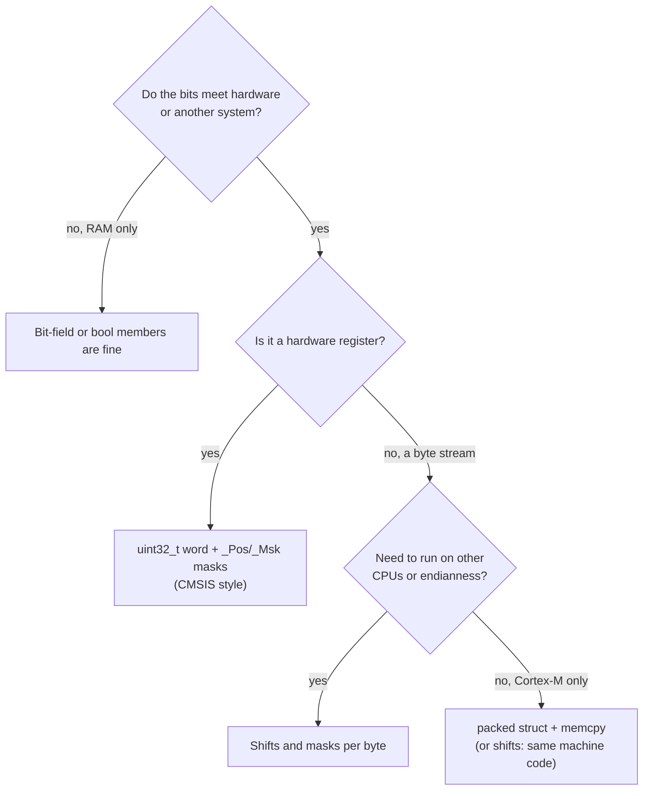

## Learning objectives

By the end of this lesson you will be able to:

1. **Explain** how `GPIOA->ODR` becomes `0x40020014`: a struct type laid over a base address, with the compiler computing `base + offsetof(member)`.
2. **Predict** `sizeof` and every `offsetof` of a struct by hand on a Cortex-M4 (natural alignment, internal padding, tail padding), and **reorder** members to remove padding.
3. **Write** a peripheral register map from the reference manual: member order, `RESERVED` words for the holes, arrays for repeated registers, access qualifiers, and a `_Static_assert` for every offset that matters.
4. **Decide** when `__attribute__((packed))` is right (wire formats), what it costs (misaligned access, `&member` warnings), and decode a byte stream three ways (shifts, `memcpy`, union), knowing which one is portable.
5. **Use** a union to give one 32-bit word two views, and state what C11 guarantees about reading a different member than the one written.
6. **Justify** why register fields are described with `_Pos`/`_Msk` masks and not with bit-fields: implementation-defined bit order and width, a hidden read-modify-write, and wrong behavior on `rc_w1` registers.

## Why this matters

A team writes its own register header for a new peripheral instead of using the vendor's. The reset-and-clock register block has a gap in the manual: nothing is listed at offset `0x28`, `0x2C`. A developer, tidying up, deletes the two `RESERVED` members. The build is clean. From then on, every register after the gap is accessed 8 bytes too low: the code that enables the UART clock writes to the register *below* the one it means, and the board boots with a dead console. Nothing faults, because every address is still valid memory-mapped I/O.

Here is the same mistake in miniature, with a GPIO map where `LCKR` was forgotten:

```c
typedef struct { uint32_t MODER, OTYPER, OSPEEDR, PUPDR, IDR, ODR, BSRR;
                 /* LCKR forgotten */ uint32_t AFR[2]; } my_gpio_t;

GPIOA->AFR[1] |= 7UL << 4;       /* "PA9 -> AF7", writes AFRL (pins 0-7) instead of AFRH */
```

A struct is a stencil: it is only as correct as its member order and its gaps. Everything in this course that touches hardware uses one: the CMSIS headers, ST's HAL, your own drivers. You'll use this lesson directly in:
- Hygiene rules for headers and `static_assert` (A0.6) and core registers such as `xPSR` and `CONTROL` (A1.2)
- The vector table as a struct of function pointers (A2.2) and clock gating through `RCC` (A4.5)
- GPIO registers and your own driver (A5.2, A5.6), timer maps (A7.2), UART ring buffers and frame headers (A8.4)
- DMA stream structs (A12.2) and Flash controller registers (A14.1)

## Concept explanation

````layer beginner
### A struct is a stencil

Imagine a sheet of tracing paper with ten labelled boxes drawn on it, each exactly 4 bytes wide, one after another. You don't build anything. You just **lay the sheet over a stretch of the memory map**, and the boxes line up with the registers underneath.

```callout analogy title="Analogy: a form printed over a wall of pigeonholes"
A wall of pigeonholes is numbered `0x40020000`, `0x40020004`, … Instead of remembering "the box with the output-latch is number `0x40020014`", you hold a transparent form over the wall. Box 6 on the form says **ODR**. You write "form.ODR" and the form tells you which pigeonhole that is. The form costs nothing, holds nothing, and can be moved: laid on GPIOB's wall (`0x40020400`) the same labels name GPIOB's boxes.
```

In C, the "form" is a `struct` and "laying it over the wall" is a pointer cast:

```c
typedef struct
{
    volatile uint32_t MODER;    /* offset 0x00 */
    volatile uint32_t OTYPER;   /* offset 0x04 */
    /* ... */
    volatile uint32_t ODR;      /* offset 0x14 */
    volatile uint32_t BSRR;     /* offset 0x18 */
} GPIO_TypeDef;

#define GPIOA  ((GPIO_TypeDef *) 0x40020000UL)

GPIOA->ODR = 0x20UL;            /* store to 0x40020014 */
```

No memory is allocated. `GPIOA` is just an address with a type attached, the cast you met in A0.4. The compiler knows `ODR` is the 6th 4-byte member, so `GPIOA->ODR` means "base + 20".

```anim
struct-overlay
```

Three rules make this work:
1. **Members are in the order of the registers.** In C, the first member sits at offset 0 and later members never move backward.
2. **Each register is a 32-bit word**, so the members are `uint32_t` and sit 4 bytes apart.
3. **Gaps in the manual become `RESERVED` members.** If the manual says nothing lives at `0x1C`, the struct needs a dummy word there. Skip it and every later register shifts.

### Repeated registers are arrays

`AFRL` and `AFRH` are the same kind of register, side by side. CMSIS declares them as `uint32_t AFR[2]`: `AFR[0]` is `AFRL` (pins 0–7) and `AFR[1]` is `AFRH` (pins 8–15). To configure pin 9: `GPIOA->AFR[9 / 8]`, bit position `(9 % 8) * 4`.

### Unions and bit-fields in one paragraph

A **union** puts several names on the *same* bytes: `uint32_t w` and `uint8_t b[4]` are two views of one word. A **bit-field** lets you name individual bits in a struct (`uint32_t ue : 1;`). Both look attractive for registers. Unions are fine. Bit-fields are a trap, and the next sections show why, so you'll understand why ST's headers use plain words and named masks.
````

````layer intermediate
### Alignment, padding and `sizeof`

Peripheral structs have no padding, because every member is a 32-bit word. Ordinary data is different. The Cortex-M4 ABI (AAPCS) gives each type a **natural alignment**, and the compiler obeys it:

| Type | `sizeof` | `_Alignof` (arm-none-eabi-gcc 10.3, verified) |
|---|---|---|
| `uint8_t` | 1 | 1 |
| `uint16_t` | 2 | 2 |
| `uint32_t`, pointers | 4 | 4 |
| `uint64_t`, `double` | 8 | **8** |

The rules for a struct are fixed by the standard and the ABI:
1. Members are laid out in declaration order; the first is at offset 0.
2. Each member starts at the next offset that is a multiple of its alignment. The compiler inserts **padding** bytes to get there.
3. `sizeof(struct)` is rounded up to a multiple of the struct's own alignment (the largest member alignment), so every element of an array is aligned. That's **tail padding**.

```anim
padding-layout
```

The result, for the same three members in three orders (the lab prints this table; the numbers below were also checked with `_Static_assert` on the ARM compiler):

| Struct | `sizeof` | offsets | Padding bytes |
|---|---|---|---|
| `{ u8 a; u32 b; u16 c; }` | 12 | a 0, b 4, c 8 | 5 |
| `{ u32 b; u16 c; u8 a; }` | 8 | b 0, c 4, a 6 | 1 |
| `packed { u8 a; u32 b; u16 c; }` | 7 | a 0, b 1, c 5 | 0 |
| `{ u8 a; u64 b; }` | 16 | a 0, b 8 | 7 |

The cheap fix is to **declare members from largest to smallest**. No compiler extension needed, no unaligned access. That's what you do for RAM data structures. Padding is also an information leak: a padded struct copied to a UART or flash page sends the unnamed bytes too. Don't memcpy padded structs onto a wire.

### Writing a register map from the reference manual

Take RM0390's *RCC register map*. Between `AHB3RSTR` (`0x18`) and `APB1RSTR` (`0x20`), nothing is listed at `0x1C`; between `APB2RSTR` (`0x24`) and `AHB1ENR` (`0x30`), nothing at `0x28`–`0x2C`. The struct has to contain those words:

```c
    MY_RW uint32_t AHB3RSTR;      /* 0x18 */
    uint32_t       RESERVED0;     /* 0x1C (hole) */
    MY_RW uint32_t APB1RSTR;      /* 0x20 */
    MY_RW uint32_t APB2RSTR;      /* 0x24 */
    uint32_t       RESERVED1[2];  /* 0x28-0x2C (hole) */
    MY_RW uint32_t AHB1ENR;       /* 0x30 */
```

Then pin down every offset you rely on, so a forgotten member is a build error and not a dead UART:

```c
_Static_assert(offsetof(my_rcc_t, AHB1ENR) == 0x30U, "RCC AHB1ENR offset");
_Static_assert(sizeof(my_rcc_t)            == 0x98U, "RCC block size");
```

The lab's `regmap.h` does this for four peripherals, and `regmap_check.h` compares each offset and each size with ST's `GPIO_TypeDef`, `USART_TypeDef`, `RCC_TypeDef` and `EXTI_TypeDef` on the target (the build passes with both, verified).

The same `volatile` / `const volatile` qualifiers as in A0.4 go on the members: `IDR` is read-only (`MY_RO` = `volatile const`), the hole words are plain (nothing may touch them). Two layout facts about the F446:
- **GPIO ports are `0x400` apart** and each block uses only `0x28` bytes of its slot: GPIOC is `GPIOA_BASE + 2 * 0x400` = `0x4002 0800`. The rest of the slot is reserved. One struct type serves all eight ports.
- **One struct per peripheral *type*, not per instance.** `USART_TypeDef` describes USART1, 2, 3, 6 and UART4, 5; `GPIO_TypeDef` describes GPIOA to H. Where instances differ, ST's header uses one superset type: `TIM_TypeDef` has `RCR` (`0x30`) and `BDTR` (`0x44`), which exist only on TIM1/TIM8, and on TIM2 those offsets are reserved. Exercise 🟡 2 builds the TIM2–TIM5 map.

### Unions: two views of one word

```c
typedef union { uint8_t raw[12]; sensor_frame_wire_t f; } sensor_frame_u;
```

C11 §6.5.2.3 note 95 and §6.5 ¶7 allow you to **write one member and read another**; the bytes are reinterpreted. (C++ does not allow it, and GCC supports it in C++ as an extension.) For a UART driver this is natural: the ISR stores each received byte into `raw[i]`, and the main loop reads `f.temp_cdeg` once the frame is complete. The result depends on **byte order** (little-endian on the Cortex-M, big-endian on many network protocols) and on **padding** (see packed, next).

### Packed structs: matching a wire format

A sensor sends this 12-byte frame, little-endian, with no padding:

| Offset | Size | Field |
|---|---|---|
| 0 | 1 | `sync` (`0xA5`) |
| 1 | 1 | `seq` |
| 2 | 2 | `temp` (`int16`, 0.01 °C) |
| 4 | 2 | `humidity` (`uint16`, 0.01 %RH) |
| 6 | 4 | `timestamp` (`uint32`, ms): **not 4-byte aligned** |
| 10 | 1 | `status` |
| 11 | 1 | `checksum` (XOR of bytes 0..10) |

A normal struct with those members is **16 bytes** and puts `timestamp_ms` at offset 8: reading the wire bytes through it gives garbage (the lab shows `0x88311234` instead of `0x12345678`). `__attribute__((packed))` removes the padding and sets the alignment to 1, so `sizeof` is 12 and `timestamp_ms` is at 6.

There are three ways to decode that frame. The lab implements all three and checks that they agree:

| Decoder | How | Portable? | Cost on Cortex-M4 (verified, GCC 10.3 `-O2`) |
|---|---|---|---|
| **Bytes** | `p[0] \| p[1] << 8 \| …` | Yes: any CPU, any endianness, any alignment | The compiler recognizes the pattern and emits one `ldr` |
| **memcpy** into a packed struct | `memcpy(&w, buf, 12)` | Little-endian CPUs only | `memcpy` is inlined away; field reads are `ldr r0, [r0, #6]` marked *unaligned* |
| **Union** | copy into `raw[]`, read `.f` | Little-endian CPUs only | same as memcpy |

The portable one is the best default: it is endian-safe and alignment-safe, and it costs nothing on the M4. The packed struct is for when you want field names on a layout that is fixed by someone else. Two rules for packed structs: never take a pointer to a member (`&w->timestamp_ms` is typed `uint32_t *`, which promises alignment 4: GCC warns with `-Waddress-of-packed-member`), and never overlay a pointer to a byte buffer onto a struct (`(struct *)buf`): the cast can be misaligned and, through a different type, violates strict aliasing. `memcpy` is the legal way to reinterpret bytes.

### Bit-fields: why not for registers

A bit-field declaration looks like a register diagram:

```c
typedef struct {
    uint32_t sbk : 1;  uint32_t rwu : 1;  uint32_t re : 1;  uint32_t te : 1;
    /* ... */           uint32_t ue : 1;  /* bit 13 */
} usart_cr1_bits_t;
```

and `cr1.b.te = 1; cr1.b.ue = 1;` is pleasant to read. But the C standard (C11 §6.7.2.1 ¶11) leaves **the allocation order of bit-fields within a unit, whether a field may straddle a unit, and the alignment of the unit implementation-defined**. Concretely:

| Property | Standard says | Consequence |
|---|---|---|
| Bit order inside the word | Implementation-defined | GCC on little-endian ARM fills from bit 0 up, so the 14th field `ue` lands on bit 13. A big-endian ABI fills from the top and puts the same field at bit 18 |
| Size of a struct mixing types | Implementation-defined | `struct { uint8_t a:4; uint16_t b:8; }`: **2 bytes** on arm-none-eabi-gcc (verified), **4 bytes** on the PC's MinGW GCC (run by the lab) |
| Width of the access | Implementation-defined | A `volatile uint8_t` field produces `LDRB`/`STRB`; a `volatile uint32_t` field usually produces `LDR`/`STR` |
| Atomicity | None | `r.b.te = 1` is a read-modify-write, like `|=` (A0.2) |
| Writing to `rc_w1` flags | None | Writing a 1 clears the flag: the compiler's read-modify-write clears every flag that was set |

```anim
bitfield-rmw
```

The last row is the killer. `EXTI_PR` is `rc_w1`: writing 1 *clears* a pending line. With a bit-field view, `PR_BF->pr13 = 1U` compiles to *read the register, OR in bit 13, write it back*. If line 0 was also pending, the read returns `0x2001`, and writing `0x2001` clears **both** lines: the line-0 interrupt is silently lost. The mask version, `EXTI->PR = EXTI_PR_PR13;`, is a plain store of `0x2000` with no read. That is why ST's peripheral headers contain **no bit-fields**: every field is `_Pos` / `_Msk` constants.

Where are bit-fields acceptable? For data in RAM that **never leaves the program**: flag sets inside your own structs, where you don't care what bit a flag lands on. If the bits are visible to hardware or to another system (a register, a wire format, a Flash record), use masks and shifts. (CMSIS itself has bit-field unions for the *core* program-status registers, e.g. `APSR_Type.b.N`. They're meant to be read from a local copy of `__get_APSR()`, never overlaid on a live address.)
````

````layer advanced
### What the compiler does with structs (GCC 10.3, `-O2`, verified)

All from `arm-none-eabi-gcc -mcpu=cortex-m4 -mthumb -O2`:

| C | Result |
|---|---|
| `GPIOA->ODR = x;` and `GPIOA->BSRR = y;` | one literal-pool load of `0x40020000`, then `str r1, [r3, #20]` / `str r2, [r3, #24]` (A0.4) |
| Read `w->timestamp_ms` (packed, offset 6) | `ldr r0, [r0, #6]` **commented `@ unaligned`**. A word load at an address that isn't a multiple of 4 |
| Read `w->temp_cdeg` (packed, offset 2) | `ldrh r0, [r0, #2]`, also commented `@ unaligned`: the packed type has alignment 1, so GCC makes no assumption about the pointer |
| The same read on **Cortex-M0** (`-mcpu=cortex-m0`) | four `ldrb` and `lsls`/`orrs` to assemble the word: M0 has no unaligned access |
| Shift-and-OR byte decode `p[0] \| p[1]<<8 \| p[2]<<16 \| p[3]<<24` | `ldr r0, [r0]` on the M4: GCC recognizes the pattern |
| `memcpy(&w, buf, 12)` in `SensorFrame_DecodeMemcpy` | **no call** to `memcpy` at all (checked: 0 calls) |
| `MODER_BF->m5 = 1U;` (`volatile uint32_t` fields) | `ldr r2,[r3]` · `bfi r2, r1, #10, #2` · `str r2,[r3]` |
| `PR_BF->pr13 = 1U;` (16 one-bit fields) | `ldrh r3,[r2,#3092]` · `orr r3,r3,#8192` · `strh r3,[r2,#3092]`: a **16-bit** read-modify-write |
| `b8->en = 1U;` (`volatile uint8_t en:1`) | `ldrb` · `orr #1` · `strb`: an **8-bit** bus access |

Things to notice:

1. **`@ unaligned` is GCC telling you what it assumed.** On the M4 an `LDR`/`LDRH`/`STR` to a Normal-memory address is allowed to be unaligned. This is what makes the packed struct *work*, and what makes it *slow* if it crosses a word boundary on the bus (extra cycles, not measured here: measure yours with the DWT cycle counter, A3.5). It's not allowed for **`LDM`, `LDRD`, `STM`, `STRD`, `VLDM`**: those always raise a UsageFault on unaligned addresses (DUI 0553, *Alignment*). A compiler that inlines a copy of a packed struct may choose them, and GCC knows the alignment is 1 only if it can see the type.
2. **`CCR.UNALIGN_TRP`** (SCB, bit 3) makes *every* unaligned access fault, including plain `LDR`. It is reset to 0. Lab `main_reg.c` has two demos (`LAB_UNALIGNED_DEMO=1` and `2`) that trigger the `UNALIGNED` bit of the UsageFault status (`CFSR` bit 24). Expected result: `CFSR = 0x01000000`. Confirm on your board; the lab prints the actual value.
3. **`volatile` bit-fields follow the AAPCS.** GCC's default for ARM is `-fstrict-volatile-bitfields`: the access uses the **declared** type's width, which is how a `volatile uint8_t` field turns into a byte access (and why RM0390's "word or half-word only" registers can't safely be described with `uint8_t` fields). With a `uint32_t` container and fields confined to the low half, GCC narrowed the access to `LDRH`/`STRH`, still a read-modify-write.
4. **`enum` size is a toolchain setting.** `arm-none-eabi-gcc` defaults to `-fshort-enums`: `enum { A, B }` is **1 byte** (verified), and on the PC it is 4. An enum in a struct shared between code compiled with different flags (a pre-built library, a bootloader) changes its layout. For wire formats and Flash records use `uint8_t`/`uint32_t` members and `static_assert` the enum's range.
5. **The same source gives different layouts on the PC.** The mixed bit-field struct is 2 bytes on the board and 4 on the PC, and enums differ. The host run in this lab is fine for *logic* (decoders, checksums, `offsetof` of all-`uint32_t` structs) but not for layouts that involve bit-fields or enums.

### What the standard promises

- **Struct layout** (§6.7.2.1 ¶15): members are allocated in order, with "no padding before the first member". Padding elsewhere is allowed and its values are unspecified. `offsetof` (§7.19) gives the truth.
- **Union type punning** (§6.5.2.3 footnote 95): reading a member other than the last one written reinterprets the object representation. Allowed in C, with the usual trap-representation caveat (none for fixed-width integers).
- **Effective types and strict aliasing** (§6.5 ¶6–7): you may access any object through a `char` type (so `memcpy` and `uint8_t` byte walks are fine), but *not* a byte array through a `struct *` or `uint32_t *`. GCC takes advantage with `-fstrict-aliasing` (on at `-O2`), and the symptom is a decode that works at `-O0` and misbehaves at `-O2`.
- **Alignment** (§6.2.8): `_Alignof`/`_Alignas` are C11. `__attribute__((aligned(n)))` is GCC's older spelling. A pointer converted from an address that isn't suitably aligned is **undefined behavior** (§6.3.2.3 ¶7), even before it is dereferenced.
- **Bit-fields** (§6.7.2.1 ¶4, ¶11): type must be `_Bool`, `signed int`, `unsigned int` or another implementation-defined type (GCC accepts all integer types and enums). Order and straddling are implementation-defined. Plain `int` bit-fields may be signed or unsigned (implementation-defined): always write `uint32_t`.

### Linking the layout to the debugger

`ptype /o my_rcc_t` in GDB (GDB 8.1 or newer; not run for this lesson) prints each member's offset and size and marks every padding hole, so you can see a struct's gaps without compiling a test. The *SFR* view in CubeIDE is generated from the SVD file, which comes from the same ST register descriptions as the header, which is why the three always agree.
````

## Under the hood

### The struct sizes of this lesson

All from the CMSIS device header `stm32f446xx.h` and RM0390; the lab checks them with `_Static_assert` against its own maps, and the build compiled (ARM GCC 10.3) with both.

| Type | `sizeof` | Last member | Notes |
|---|---|---|---|
| `GPIO_TypeDef` | `0x28` (40) | `AFR[2]` at `0x20` | 8 ports, `0x400` apart |
| `USART_TypeDef` | `0x1C` (28) | `GTPR` at `0x18` | USART1, 2, 3, 6; UART4, 5 |
| `RCC_TypeDef` | `0x98` (152) | `DCKCFGR2` at `0x94` | 7 reserved gaps |
| `EXTI_TypeDef` | `0x18` (24) | `PR` at `0x14` | `PR` is `rc_w1` |
| `TIM_TypeDef` | `0x54` (84) | `OR` at `0x50` | `RCR`/`BDTR` only on TIM1/TIM8 |
| `DMA_Stream_TypeDef` | `0x18` (24) | `FCR` at `0x14` | stream *n* of a DMA at `DMA_BASE + 0x10 + 0x18 * n` |

### From `GPIOA->ODR` to the bus

```mermaid caption="What the compiler does with GPIOA->ODR = x: the struct costs nothing at run time"
flowchart LR
    SRC["GPIOA->ODR = x;"] --> CAST["GPIOA = ((GPIO_TypeDef *) 0x40020000)"]
    CAST --> OFF["offsetof(GPIO_TypeDef, ODR) = 0x14<br/>(known at compile time)"]
    OFF --> ASM["ldr r3, =0x40020000<br/>str r1, [r3, #20]"]
    ASM --> BUS["AHB1 write to 0x40020014<br/>= GPIOA_ODR"]
```

### Choosing a representation



### What to read

| Document | Section | Why |
|---|---|---|
| RM0390 | *GPIO registers*, *RCC register map*, *EXTI registers*, *TIM2 to TIM5 registers*, *DMA register map* | Offsets, reserved gaps, access types (`rw`, `rc_w1`, …) |
| RM0390 | *Memory map → Register boundary addresses* | Peripheral base addresses and their bus |
| Arm DUI 0553 | *Memory model → Unaligned accesses*; *CCR*; *CFSR → UFSR.UNALIGNED* | Which instructions may be unaligned, and how to trap them |
| Arm AAPCS32 (IHI 0042) | *Data types and alignment*; *Bit-fields*; *Enumerated types* | The layout rules behind every `sizeof` here |
| ISO C11 (N1570) | §6.7.2.1 (struct and bit-fields), §6.5.2.3 (union), §6.5 ¶7 (aliasing), §6.2.8 (alignment) | The language rules |
| GCC manual | *Type Attributes* → `packed`, `aligned`; *`-fshort-enums`*; *`-fstrict-volatile-bitfields`*; *`-Waddress-of-packed-member`* | What the compiler actually does |
| CMSIS `core_cm4.h`, `stm32f446xx.h` | `SCB_Type`, `ITM_Type` (union `PORT`), `APSR_Type`, `GPIO_TypeDef`, `RCC_TypeDef` | Real-world register structs, reserved words and unions |

## Hands-on lab: the register-map workshop

**Goal:** write your own register maps for GPIO, USART, RCC and EXTI, prove at compile time that they match ST's CMSIS structs, and use them to drive the board. Then print `sizeof` and `offsetof` of ordinary structs, decode a wire frame stored at an odd address three ways, and compare the PC's and the board's answers.

**No wiring needed:** LD2 is **PA5**, B1 is **PC13**, and the console is USART2 through the ST-LINK VCP at 115200 8N1.

### Step 1: CubeMX configuration (HAL version)

Start from the A0.4 project (*Copy/Paste*, rename it `A0_5_RegisterMaps`):

1. **Clock**: System Clock Mux = **HSI**, HCLK = **16 MHz**, APB1/APB2 prescalers **/1**.
2. **PA5**: `GPIO_Output`, label **`LD2`**. **PC13**: `GPIO_Input`, label **`B1`**, pull-up.
3. **USART2**: Asynchronous, 115200 8N1.
4. **Warnings**: `-Wall -Wextra -Wconversion -Wsign-conversion -Wshadow`. Generate code.

### Step 2: add the lab library

Five portable files that need no device header (they build on the PC too), plus one target-only check:

- `regmap.h`: our `my_gpio_t`, `my_usart_t`, `my_rcc_t`, `my_exti_t`, with a `_Static_assert` for every offset and size.
- `regmap_check.h` *(target only)*: compares each of our offsets and sizes with CMSIS.
- `sensor_frame.[ch]`: the 12-byte frame, with encoder and three decoders.
- `layout_report.[ch]`: prints the tables (register maps, padding, bit-fields, frames).

```c file=A0.5/Core/Inc/regmap.h
```

```c file=A0.5/Core/Inc/regmap_check.h
```

```c file=A0.5/Core/Inc/sensor_frame.h
```

```c file=A0.5/Core/Src/sensor_frame.c
```

```c file=A0.5/Core/Inc/layout_report.h
```

```c file=A0.5/Core/Src/layout_report.c
```

### Step 3: HAL `main.c`

The HAL drives the board through CMSIS's `GPIO_TypeDef`. The program lays *our* `my_gpio_t` over the same addresses and shows both views agree: at build time (`regmap_check.h`) and at run time (same addresses, same register contents). A press of B1 sends one frame through the encoder and decoder.

```c file=A0.5/Core/Src/main.c
```

### Step 4: register-level version

Use an **Empty** project as in A0.1. `main_reg.c` touches peripherals **only** through `MY_RCC`, `MY_GPIOA`, `MY_GPIOC` and `MY_USART2`. The CMSIS header is included for the core (`SCB`, `DWT`) and for the compile-time check. It also has two optional alignment demos, selected with `-DLAB_UNALIGNED_DEMO=1` or `2`.

```c file=A0.5/Core/Src/main_reg.c
```

### Step 5 (optional): on your PC

The register maps, the padding table, the bit-field results and the frame decoders all run on a PC: nothing here dereferences a peripheral address.

```c file=A0.5/host/host_main.c
```

```bash title="PC build (verified: GCC 12.1, 0 warnings)"
gcc -std=c11 -O2 -Wall -Wextra -Wconversion -Wsign-conversion -Wshadow -ICore/Inc \
    host/host_main.c Core/Src/layout_report.c Core/Src/sensor_frame.c -o layouts
./layouts
```

```console title="PC output (real run)"
=== A0.5 Register maps & layouts (host) ===

--- my_gpio_t @ GPIOA: sizeof = 40 (0x28) ---
member      offset  size  address
MODER       0x00    4     0x40020000
OTYPER      0x04    4     0x40020004
OSPEEDR     0x08    4     0x40020008
PUPDR       0x0C    4     0x4002000C
IDR         0x10    4     0x40020010
ODR         0x14    4     0x40020014
BSRR        0x18    4     0x40020018
LCKR        0x1C    4     0x4002001C
AFR[0]      0x20    4     0x40020020
AFR[1]      0x24    4     0x40020024

--- my_usart_t @ USART2: sizeof = 28 (0x1C) ---
member      offset  size  address
SR          0x00    4     0x40004400
DR          0x04    4     0x40004404
BRR         0x08    4     0x40004408
CR1         0x0C    4     0x4000440C
CR2         0x10    4     0x40004410
CR3         0x14    4     0x40004414
GTPR        0x18    4     0x40004418

--- my_rcc_t @ RCC (0x14..0x44): sizeof = 152 (0x98) ---
member      offset  size  address
AHB2RSTR    0x14    4     0x40023814
AHB3RSTR    0x18    4     0x40023818
(hole)      0x1C    4     0x4002381C
APB1RSTR    0x20    4     0x40023820
APB2RSTR    0x24    4     0x40023824
(hole)      0x28    4     0x40023828
(hole)      0x2C    4     0x4002382C
AHB1ENR     0x30    4     0x40023830
AHB2ENR     0x34    4     0x40023834
AHB3ENR     0x38    4     0x40023838
(hole)      0x3C    4     0x4002383C
APB1ENR     0x40    4     0x40023840
APB2ENR     0x44    4     0x40023844

GPIO ports are 0x400 apart, my_gpio_t is 0x28 bytes: the rest of each slot is reserved

--- Padding: same members, different layouts ---
struct                          sizeof   a   b   c  padding
{ u8 a; u32 b; u16 c; }             12   0   4   8        5
{ u32 b; u16 c; u8 a; }              8   6   0   4        1
packed { u8 a; u32 b; u16 c; }       7   0   1   5        0
{ u8 a; u64 b; }                    16   0   8   -        7
_Alignof: u16 2, u32 4, u64 8, double 8, packed_abc 1
sensor frame: naive struct 16 bytes (timestamp @ 8), packed 12 bytes (timestamp @ 6)

--- Bit-fields: USART_CR1 through a union ---
cr1.b.te = 1; cr1.b.ue = 1;  ->  cr1.w = 0x00002008
CR1_TE | CR1_UE (masks)      ->          0x00002008  (same on this compiler)
byte 0 of cr1 in memory = 0x08, byte 1 = 0x20

--- Implementation-defined sizes on this compiler ---
sizeof(struct { uint8_t a:4; uint16_t b:8; }) = 4
sizeof(enum { VALUE_A, VALUE_B })             = 4

--- Sensor frame at rx+1 (timestamp at rx+7: not 4-byte aligned) ---
bytes: A5 07 2E FB D7 11 78 56 34 12 31 88
decoder   seq  temp_cdeg  hum_cpct  timestamp_ms  status
bytes       7      -1234      4567   0x12345678    0x31  id=3
memcpy      7      -1234      4567   0x12345678    0x31  id=3
union       7      -1234      4567   0x12345678    0x31  id=3
all three decoders match the sent values: yes
naive padded struct: timestamp_ms = 0x88311234 (expected 0x12345678), status = 0xEE
flip bit 0 of byte 4 -> checksum rejects the frame

frame checks failed: 0
```

The register-map tables, the padding table, the frame bytes and the decoded values are **identical on the board**, because they depend only on the struct layouts (checked with `_Static_assert` on the ARM compiler), on the byte order (little-endian on both) and on arithmetic. Two lines are *not* the same on the board, and that is the point of printing them:

| Line | PC (MinGW GCC 12.1) | Board (arm-none-eabi-gcc 10.3, verified with `_Static_assert`) |
|---|---|---|
| `sizeof(struct { uint8_t a:4; uint16_t b:8; })` | 4 | **2** |
| `sizeof(enum { VALUE_A, VALUE_B })` | 4 | **1** (`-fshort-enums`) |

### Line-by-line: the non-obvious lines

| Line | Explanation |
|---|---|
| `#define MY_RW volatile` / `MY_RO volatile const` | The access type of each register, as in CMSIS `__IO` / `__I` (A0.4). Only `const` is enforced. |
| `uint32_t RESERVED0;` etc. in `my_rcc_t` | The reference manual lists nothing at `0x1C`. The word keeps `APB1RSTR` at `0x20`. Not `volatile`: nothing should ever touch it. |
| `_Static_assert(offsetof(my_gpio_t, AFR) == 0x20U, …)` | The build fails if a member is missing, duplicated or reordered. |
| `#define MY_REG_ADDR(base, type, member) ((uint32_t)(base) + (uint32_t)offsetof(type, member))` | A register's address as an integer constant expression, so it can sit inside `_Static_assert` with no dereference. |
| `REGMAP_SAME(my_gpio_t, GPIO_TypeDef, BSRR)` | Compares *our* offset with the vendor's at build time. Two independent sources must agree. |
| `ROW(type, member)` in `layout_report.c` | One table row computed from `offsetof` and `sizeof` of the type itself, so a number is never typed twice. |
| `sizeof(((type *)0)->member)` | The size of a member without an object. `sizeof` doesn't evaluate its operand, so the null pointer is never dereferenced. |
| `struct __attribute__((packed)) { … }` | No padding, alignment 1: exactly the wire layout. |
| `_Static_assert(offsetof(sensor_frame_wire_t, timestamp_ms) == 6U, …)` | The protocol document says byte 6. The compiler checks it. |
| `(int16_t)((int32_t)(raw ^ 0x8000U) - 0x8000)` (`s16_from_u16`) | Converts a 16-bit two's-complement pattern to `int16_t` with no implementation-defined cast (A0.1). |
| `memcpy(&w, buf, sizeof w);` | The one defined way to reinterpret bytes; GCC turns it into direct loads. |
| `_Alignas(8) uint8_t rx[…]; uint8_t *const frame = &rx[1];` | Places the frame at an odd address on purpose, so `timestamp_ms` sits at `rx + 7`. |
| `naive.timestamp_ms != sent.timestamp_ms` counted as a failure *if equal* | A negative test: the report fails if the naive struct *accidentally works*. |
| `MY_GPIOA->BSRR = 1UL << LED_PIN;` (`main.c`) | Written through our struct, read back through `HAL_GPIO_ReadPin()`: both views reach the same silicon. |
| `MY_GPIOA->AFR[0] = (MY_GPIOA->AFR[0] & ~mask) \| …` | `AFR[0]` is the 9th word at `0x20`: `AFRL`, pins 0–7. PA2/PA3 use `AFR[0]`. |
| `void __attribute__((noipa)) read_u64(…)` | Hides the pointer's alignment from GCC, as real code would with a pointer from a parser; otherwise GCC 10.3 splits the `LDRD` into two safe `LDR`s. |
| `SCB->SHCSR \|= SCB_SHCSR_USGFAULTENA_Msk;` | Without it the UsageFault escalates to HardFault; with it, `UsageFault_Handler` runs and prints `CFSR`. |

### Step 6: run and verify

Build (0 warnings expected: every lab file was compiled with ARM GCC 10.3 at `-O2` under the flags above, with the unaligned demos both off and on, and on the host with GCC 12.1). Open the VCP at 115200, flash, press **RESET**.

**Register-level version** (`main_reg.c`):

```console title="USART2 @ 115200 — main_reg.c (first lines; the rest is the PC output above)"
=== A0.5 Register maps & layouts (registers) ===
RCC->AHB1ENR = 0x????0005  RCC->APB1ENR = 0x????0000  USART2->BRR = 0x0000008B
```

Expected from the code (board only: compare with yours): `AHB1ENR` low bits `0x5` (`GPIOAEN` bit 0, `GPIOCEN` bit 2), `APB1ENR` bit 17 (`USART2EN`) set (`0x0002….`), `BRR = 0x8B` (`16 MHz / 115200 = 138.9`, rounded to 139). The upper bits are the chip's reset state and are not asserted here. After the common tables:

```console title="USART2 @ 115200 — alignment demo off (default)"
--- Alignment on the Cortex-M4 ---
SCB->CCR = 0x00000200, UNALIGN_TRP = 0
set LAB_UNALIGNED_DEMO to 1 or 2 to see the fault

Press B1: LED follows the button (my_gpio_t only).
```

`CCR` resets to `0x0000 0200` (`STKALIGN`, DUI 0553). To trigger the faults, rebuild with `-DLAB_UNALIGNED_DEMO=1` (sets `UNALIGN_TRP`, then one unaligned 32-bit `LDR`) or `=2` (an unaligned 64-bit read through a pointer GCC can't see into, which uses `LDRD`). Expected on the architecture: the handler prints `!!! UsageFault  CFSR = 0x01000000  UNALIGNED = 1`. **Run it to confirm**: this lesson did not run it on hardware.

**HAL version** (`main.c`), first lines:

```console title="USART2 @ 115200 — main.c (HAL), expected from the code"
=== A0.5 Register maps & layouts (HAL) ===

--- Two views of the same silicon ---
GPIOA           = 0x40020000   MY_GPIOA           = 0x40020000
&GPIOA->AFR[1]  = 0x40020024   &MY_GPIOA->AFR[1]  = 0x40020024
&huart2.Instance->BRR = 0x40004408   &MY_USART2->BRR = 0x40004408
huart2.Instance->BRR = 0x0000008B   MY_USART2->BRR  = 0x0000008B
GPIOA->MODER    = 0xA80004A0   MY_GPIOA->MODER    = 0xA80004A0
MY_GPIOA->BSRR = 1 << 5  ->  HAL_GPIO_ReadPin(LD2) = 1
MY_GPIOA->BSRR = 1 << 21 ->  HAL_GPIO_ReadPin(LD2) = 0
```

`MODER` is the reset value `0xA800 0000`, plus `0xA0` (PA2/PA3 in AF, set by the HAL's UART MSP code) and `0x400` (PA5 output): the same `0xA80004A0` as A0.4. Every press of B1 then prints `frame #n: ok  temp=2150 cdeg  hum=4012 c%  t=<ms> ms` and toggles LD2. Because `regmap_check.h` is included, a wrong offset in `regmap.h` would not have built at all.

**In the debugger:** break after `Report_Printf` in `Demo_TwoViews()`, open the *Expressions* view and add `*MY_GPIOA`: the struct expands into its ten registers with the live values, the same as `*GPIOA`. Then add `sizeof(my_rcc_t)` and compare it with `0x98`.

## Common mistakes & debugging

### 1. A `RESERVED` gap left out of a register struct
- **Symptom:** a peripheral that "never reacts" or the wrong one reacts; no fault, no warning.
- **Why:** every member after the gap is at a lower offset than the manual says, so `RCC->AHB1ENR` writes `APB2RSTR`, or `AFR[1]` writes `AFR[0]`.
- **Diagnose:** print `(uintptr_t)&PERIPH->REG - (uintptr_t)PERIPH`, or look at the store's address in the disassembly.
- **Fix:** one `_Static_assert(offsetof(...) == 0x..)` per register you use, plus one for `sizeof`. Compare with the vendor header on the target (`regmap_check.h`).

### 2. Byte offset used for the array index
- **Symptom:** `GPIOA->AFR[8]` or `AFR[0x24]` compiles and writes far beyond the block.
- **Why:** `AFR` has two elements; `AFR[1]` is already at `0x24`. Indexing counts elements, not bytes (A0.4).
- **Fix:** `AFR[pin / 8U]`, bit position `(pin % 8U) * 4U`.

### 3. A padded struct sent over a wire or stored in Flash
- **Symptom:** the receiver gets shifted fields; a checksum computed over the struct includes garbage; a Flash record is 16 bytes when the format says 12.
- **Why:** the compiler inserted padding (unspecified values) between members.
- **Diagnose:** `sizeof` and `offsetof` printed or `static_assert`ed against the protocol (`naive struct 16 bytes (timestamp @ 8)` in the lab).
- **Fix:** serialize field by field with shifts, or use `packed` with `memcpy`, and `_Static_assert(sizeof(frame) == 12U, …)`.

### 4. `(struct frame *)buf` on a byte buffer
- **Symptom:** works at `-O0`, wrong or a UsageFault at `-O2`, or on a different chip.
- **Why:** the cast can create a misaligned pointer (undefined behavior) and accessing a `uint8_t` array through another type violates strict aliasing.
- **Fix:** `memcpy` into a local struct (it compiles to direct loads), or decode with shifts.

### 5. A pointer to a packed member
- **Symptom:** `warning: taking address of packed member … may result in an unaligned pointer value [-Waddress-of-packed-member]` (verified), and later a fault on a core without unaligned access.
- **Why:** `&w->timestamp_ms` has type `uint32_t *`, which promises 4-byte alignment that the packed member doesn't have.
- **Fix:** copy the member to a local (`uint32_t t = w->timestamp_ms;`) or `memcpy` it.

### 6. Bit-fields describing a hardware register
- **Symptom:** flags vanish (`rc_w1`/`rc_w0` registers), neighbouring bits change, or code that worked with one compiler version breaks with another.
- **Why:** a bit-field assignment is a hidden read-modify-write (verified `LDR`/`BFI`/`STR`), its bit order and access width are implementation-defined, and no bit-field has atomic or write-1 semantics.
- **Fix:** `uint32_t` registers with `_Pos`/`_Msk` masks. Use bit-fields only for RAM data that never meets hardware.

### 7. Assuming the PC layout equals the board's
- **Symptom:** a host unit test passes, the same struct is a different size on the target.
- **Why:** the layout of bit-fields, enums and `long` depends on the ABI. The lab shows `sizeof` of a mixed bit-field struct as 4 on the PC and 2 on the board, and an enum as 4 vs 1.
- **Fix:** run the layout checks (`_Static_assert`) in the **target** build. Use only fixed-width members in anything shared.

### 8. A union read as if it were byte-order-neutral
- **Symptom:** `u.w = 0x12345678; u.b[0]` is `0x78` on the M4 and `0x12` on a big-endian host.
- **Why:** the Cortex-M4 is little-endian; a union exposes the byte order. Many protocols are big-endian.
- **Fix:** decode multi-byte protocol fields with explicit shifts (`(p[0] << 8) | p[1]`) when the byte order is part of the format.

### 9. Forgetting `volatile` on a struct member
- **Symptom:** a polling loop on a status register compiles to a single load and spins forever at `-O2` (A0.3, A0.4).
- **Why:** `volatile` on the *pointer* (`GPIO_TypeDef *volatile`) does not make the *members* volatile. The qualifier must be on each member.
- **Fix:** copy the vendor style: `__IO uint32_t` for every register member, `__I` for read-only.

### 10. An unaligned `LDRD`, `STM` or 64-bit access
- **Symptom:** `UsageFault` (or HardFault if the UsageFault handler is off) with `CFSR.UNALIGNED` set, on a pointer into a packed struct or a byte buffer.
- **Why:** unaligned *word and halfword* accesses are allowed on the M4, but double-word and multiple-register accesses always require word alignment.
- **Diagnose:** read `SCB->CFSR` (bit 24) and the stacked PC (A3.6).
- **Fix:** `memcpy` the data to an aligned local, or declare the buffer with `_Alignas(4)`/`_Alignas(8)`.

## Best practices & production tips

```callout production title="How professional code describes memory-mapped hardware"
- **Use the vendor header for the chip you ship.** `GPIO_TypeDef` and friends are generated from ST's own register descriptions. Write your own map only for an unsupported block, a soft peripheral in an FPGA, or to teach (this lab).
- **Own maps get `_Static_assert` on every offset and on `sizeof`.** The assertion is the datasheet in executable form: a wrong map becomes a build error. Do it again against the vendor header if both exist.
- **All members `uint32_t` (or the width of the register), qualified `volatile`/`volatile const`.** No bit-fields, no `char`, no padding. Holes are `RESERVED` words, never deleted "to tidy up".
- **One struct type per peripheral family, instance by base address.** Add an array when registers repeat (`AFR[2]`, DMA `S[8]`) and verify the stride with a `static_assert`.
- **RAM structs: order members largest to smallest** and check `sizeof` with `static_assert` when the size is part of a contract (flash records, DMA descriptors, messages).
- **Wire formats are serialized, not overlaid.** Shifts and masks per field are endian-safe, alignment-safe and, on the M4, cost nothing. Use `packed` + `memcpy` when you need named fields, and never take the address of a packed member.
- **Bit-fields only for RAM flags that never leave the program**, and never in a header shared with another toolchain.
- **Check enum sizes across toolchains** (`-fshort-enums` is the arm-none-eabi default) before putting an enum in a shared struct.
- **MISRA C:2012** restricts bit-fields to explicitly unsigned or signed types (Rule 6.1, required) and has an advisory on unions (Rule 19.2); register-layout headers are normally a documented deviation (A0.6).
```

## Quiz

```quiz
[
  {
    "q": "A peripheral struct is all `uint32_t` members. What does `&PERIPH->REG` evaluate to?",
    "options": ["The address of the struct's start", "`base + offsetof(type, REG)`, computed by the compiler", "`base + 4 * (member number)` at run time", "An address the linker chooses"],
    "answer": 1,
    "why": "The struct is only a type. The cast `((type *)base)` supplies the base, and offsetof is a compile-time constant, so the access is one store with an immediate offset, such as `str r1, [r3, #20]` for GPIOA->ODR."
  },
  {
    "q": "On Cortex-M4 with arm-none-eabi-gcc, what are `sizeof` and the offset of `c` in `struct { uint8_t a; uint32_t b; uint16_t c; }`?",
    "options": ["7 and 5", "8 and 6", "12 and 8", "12 and 6"],
    "answer": 2,
    "why": "a is at 0; b must start on a multiple of 4, so 3 bytes of padding put it at 4; c (2-byte aligned) goes at 8; tail padding rounds the size up to a multiple of 4, giving 12. Declaring b, c, a gives 8; packed gives 7."
  },
  {
    "q": "The RM lists nothing at RCC offset 0x1C. What must your `my_rcc_t` contain there?",
    "options": ["Nothing: the compiler skips reserved addresses", "A `uint32_t RESERVED0;` placeholder, so the next register stays at 0x20", "A `#pragma pack`", "A bit-field of 32 bits"],
    "answer": 1,
    "why": "A struct has no knowledge of the memory map. Leaving out the hole shifts every later member 4 bytes down. Keep the placeholder and add a _Static_assert on the offset of the register after it."
  },
  {
    "q": "Why does ST's CMSIS header describe `EXTI->PR` with masks and not with a bit-field struct?",
    "options": ["Bit-fields are not allowed in headers", "A bit-field assignment is a read-modify-write, which on a write-1-to-clear register clears every pending line that was set", "Bit-fields are slower than masks on the Cortex-M4", "The C compiler cannot place bit-fields in volatile memory"],
    "answer": 1,
    "why": "PR is rc_w1: writing 1 clears the flag. `PR_BF->pr13 = 1` compiles to load, OR, store, which writes back every bit that was read as 1 and clears lines you didn't mean to. `EXTI->PR = EXTI_PR_PR13;` stores only bit 13."
  },
  {
    "q": "You decode a UART frame in a `uint8_t buf[12]` with `((frame_t *)buf)->timestamp`. Which statement is correct?",
    "options": ["Always fine on little-endian CPUs", "Fine if the struct is packed", "Undefined behavior: a possibly misaligned pointer and a strict-aliasing violation; use `memcpy` or shifts", "Fine if `-O0` is used"],
    "answer": 2,
    "why": "The cast may create a misaligned pointer (UB), and accessing a char array through another type breaks the effective-type rules. A packed struct makes the alignment problem go away but not the aliasing one. memcpy into a local is defined and compiles to the same loads."
  },
  {
    "q": "The board prints `sizeof(struct { uint8_t a:4; uint16_t b:8; }) = 2` while your PC test printed 4. What does that show?",
    "options": ["The board's compiler has a bug", "Bit-field layout is implementation-defined, so host tests can't validate layouts that use them", "The PC test was built without optimization", "uint16_t is 4 bytes on the PC"],
    "answer": 1,
    "why": "C leaves the packing of bit-fields to the implementation (here the ABI). MinGW GCC allocates a 4-byte unit, the ARM ABI packs both into a halfword. Layout checks have to run in the target build."
  }
]
```

## Exercises

### 🟢 Exercise 1: layouts by hand

For **arm-none-eabi-gcc on a Cortex-M4**, give `sizeof` and the requested offsets of each type. Write down the padding positions, then check with a small program on your PC that uses `offsetof` (everything below is plain integers, so the PC agrees).

| # | Type | Asked |
|---|---|---|
| a | `struct { uint8_t a; uint16_t b; uint8_t c; }` | `sizeof`, offset of `c` |
| b | the same members in the order `a, c, b` | `sizeof` |
| c | `struct { uint16_t x; uint32_t y; uint8_t z; }` | `sizeof`, offset of `z` |
| d | `struct { char name[5]; uint32_t id; }` | `sizeof`, offset of `id` |
| e | `struct { uint8_t flags; uint32_t count; uint8_t mode; uint16_t id; }` | `sizeof`, offsets of `mode` and `id` |
| f | the members of (e) in the order `count, id, flags, mode` | `sizeof` |
| g | `union { uint8_t b[6]; uint32_t w; }` | `sizeof` |

**Hints:** a member's offset is the next multiple of its alignment. The struct's size is rounded up to its largest alignment. A union's size is its largest member, rounded up to its alignment.

````solution title="Show the answers (checked with _Static_assert on the ARM compiler and a PC program)"
| # | Result | Reasoning |
|---|---|---|
| a | 6; `c` at 4 | a 0, pad 1, b 2–3, c 4, tail pad 1 |
| b | 4 | a 0, c 1, b 2–3: no padding at all |
| c | 12; `z` at 8 | x 0–1, pad 2, y 4–7, z 8, tail pad 3 |
| d | 12; `id` at 8 | name 0–4, pad 3, id 8 (the array doesn't change the alignment, `char` is 1) |
| e | 12; `mode` at 8, `id` at 10 | flags 0, pad 3, count 4–7, mode 8, pad 1, id 10–11 |
| f | 8 | count 0–3, id 4–5, flags 6, mode 7 |
| g | 8 | 6 bytes of array, the union is aligned to 4 (because of `w`), so 8 |

The lesson: (a) to (b) and (e) to (f) show that reordering, with no tricks, saves 2 to 4 bytes per instance.
````

### 🟡 Exercise 2: a map for TIM2 to TIM5

From RM0390's *TIM2 to TIM5 register map*, write `my_tim_t` for TIM2…TIM5 with these offsets: `CR1` 0x00, `CR2` 0x04, `SMCR` 0x08, `DIER` 0x0C, `SR` 0x10, `EGR` 0x14, `CCMR1` 0x18, `CCMR2` 0x1C, `CCER` 0x20, `CNT` 0x24, `PSC` 0x28, `ARR` 0x2C, **(reserved 0x30)**, `CCR1` to `CCR4` 0x34 to 0x40, **(reserved 0x44)**, `DCR` 0x48, `DMAR` 0x4C, `OR` 0x50. Use an array for the four `CCR`s. Add `_Static_assert`s for `SR`, `CNT`, `ARR`, `CCR[0]`, `CCR[3]`, `OR` and `sizeof`, define the base addresses of TIM2 (`0x4000 0000`) to TIM5 (`0x4000 0C00`), and then add the build-time check that it equals CMSIS's `TIM_TypeDef`. Why does CMSIS reserve nothing at `0x30` and `0x44`?

**Hints:** the reserved words are the missing `RCR` (0x30) and `BDTR` (0x44) of the advanced timers. `CCR` holds four registers, so index 0 is `CCR1`.

````solution title="Show a reference solution (compiled for Cortex-M4, 0 warnings; checked against TIM_TypeDef)"
```c file=A0.5/solutions/my_tim.h
```

CMSIS uses one `TIM_TypeDef` for every timer, including TIM1/TIM8, so it names `RCR` and `BDTR` instead of reserving them. Their offsets exist in the type but are not implemented on TIM2: reading them there is a read of a reserved address. Neither approach is wrong. The reserved-word map is stricter, because you can't accidentally name a register that the timer doesn't have.
````

### 🔴 Exercise 3: DMA as one struct with an array of streams

RM0390's DMA register map has four flag registers (`LISR`, `HISR`, `LIFCR`, `HIFCR`) at offsets `0x00`–`0x0C`, then **eight streams**, each with six registers (`CR`, `NDTR`, `PAR`, `M0AR`, `M1AR`, `FCR`), starting at `0x10`, with stream *n* at `0x10 + 0x18 * n`. DMA1 is at `0x4002 6000`, DMA2 at `0x4002 6400`.

1. Define `my_dma_stream_t` and `my_dma_t` so that `MY_DMA2->S[n].CR` works for any *n*, with `_Static_assert`s for the stride, stream 7 (`0xB8`), and `sizeof(my_dma_t)`. Check the result against CMSIS (`DMA_TypeDef`, `DMA_Stream_TypeDef`, `DMA2_Stream7_BASE`).
2. The flags of stream *n* in `LISR`/`HISR` are not evenly spaced: stream 0 uses bits 0 to 5, stream 1 bits 6 to 11, stream 2 bits 16 to 21 and stream 3 bits 22 to 27 (and the same again for streams 4 to 7 in `HISR`). Write `my_dma_flags(dma, n)` and `my_dma_clear(dma, n, flags)`. Explain why a bit-field struct is a poor fit here and which write pattern the flag-clear registers need (A0.2).

**Hints:** the six flags of a stream are `FEIF` (bit 0), `DMEIF` (2), `TEIF` (3), `HTIF` (4), `TCIF` (5), relative to the stream's start. `LIFCR`/`HIFCR` clear a flag when you write 1.

````solution title="Show the solution (compiled for Cortex-M4, 0 warnings; layout checked against DMA_TypeDef and DMA_Stream_TypeDef)"
```c file=A0.5/solutions/my_dma.h
```

**1.** `sizeof(my_dma_stream_t) == 0x18`, `offsetof(my_dma_t, S) == 0x10`, stream 7 at `0xB8`, and `sizeof(my_dma_t) == 0xD0`; `DMA2_BASE + 0xB8` equals CMSIS's `DMA2_Stream7_BASE` (checked). CMSIS declares eight separate `DMA2_StreamN` pointers; the nested array lets a driver index a stream by number.

**2.** The flags sit at positions 0, 6, 16 and 22 in two registers, with gaps: a single bit-field struct can't describe "the same layout, at four irregular positions, in one of two registers", and each assignment would be a read-modify-write on a register that must only be written with 1s. The clear function is one plain store of `flags << shift` to `LIFCR` or `HIFCR`: bits written as 0 are ignored, so there is no race.
````

## Cheat sheet

```callout tip title="A0.5 on one screen"
**Struct as register map:** `typedef struct { __IO uint32_t REG0; … } T;` · `#define P ((T *) BASE)` · `P->REG` = `BASE + offsetof(T, REG)`. Zero run-time cost: one base load, then `str r, [base, #offset]`.

**Rules:** members in register order · all `uint32_t` (no padding) · holes = `uint32_t RESERVEDn[k]` · repeated registers = arrays (`AFR[2]`) · `__I` read-only · `_Static_assert(offsetof(T, REG) == 0x..)` and `sizeof(T)`.

| Type | Size / align (ARM) |
|---|---|
| `u8` / `u16` / `u32`, ptr / `u64`, `double` | 1/1 · 2/2 · 4/4 · **8/8** |

**Padding:** each member at the next multiple of its alignment; `sizeof` rounded up to the largest alignment. Reorder largest to smallest. `{u8,u32,u16}` = 12, `{u32,u16,u8}` = 8, packed = 7.

**Sizes:** GPIO `0x28` · USART `0x1C` · RCC `0x98` · EXTI `0x18` · TIM `0x54` · DMA stream `0x18`.

**Wire data:** serialize with shifts (portable) or `packed` + `memcpy` (little-endian). Never `(struct *)buf`, never `&packed->member`.

**Union:** write one member, read another: defined in C11, byte order shows through.

**Bit-fields:** implementation-defined bit order, size and access width; assignment = read-modify-write (`ldr` / `bfi` / `str`); wrong on `rc_w1`. **Registers use masks, not bit-fields.** On arm-none-eabi: `enum` is 1 byte (`-fshort-enums`), a mixed `a:4; u16 b:8` struct is 2 bytes.

**Unaligned (M4):** `LDR`/`LDRH`/`STR` allowed (unless `CCR.UNALIGN_TRP`), `LDRD`/`LDM`/`STM` fault (`CFSR` bit 24).

**Checklist:** every hole reserved ✓ · `volatile` on each member ✓ · offset asserts ✓ · size assert ✓ · target-side check against CMSIS ✓ · wire format serialized, not overlaid ✓
```

## References & further reading

- **ST RM0390, STM32F446xx reference manual**: *Memory map → Register boundary addresses*; *GPIO registers*; *USART registers*; *RCC register map*; *EXTI registers*; *TIM2 to TIM5 registers*; *DMA register map* (and the access type of each register: `rw`, `r`, `w`, `rc_w1`).
- **Arm DUI 0553, Cortex-M4 Devices Generic User Guide**: *Memory model → Unaligned accesses*; *System control block → CCR (UNALIGN_TRP, STKALIGN), CFSR/UFSR (UNALIGNED)*.
- **Arm AAPCS32 (IHI 0042)**: *Fundamental data types and alignment*; *Bit-fields*; *Enumeration types* (why `-fshort-enums` is the bare-metal default).
- **CMSIS-Core (Cortex-M)**: `core_cm4.h`: `SCB_Type`, `ITM_Type` (union `PORT`), `APSR_Type`; `cmsis_gcc.h`: `__PACKED_STRUCT`, `__UNALIGNED_UINT32_READ`. ST `stm32f446xx.h`: `GPIO_TypeDef`, `USART_TypeDef`, `RCC_TypeDef`, `EXTI_TypeDef`, `TIM_TypeDef`, `DMA_TypeDef`, `DMA_Stream_TypeDef`.
- **ISO/IEC 9899:2011 (N1570)**: §6.7.2.1 *Structure and union specifiers* (padding, bit-fields), §6.5.2.3 *Structure and union members* (footnote 95, type punning), §6.5 ¶6–7 *effective type and aliasing*, §6.2.8 *Alignment*, §6.3.2.3 ¶7 *pointer alignment*, §7.19 `offsetof`.
- **GCC manual**: *Type Attributes* (`packed`, `aligned`); *Structure-Layout Pragmas*; *Code Gen Options* → `-fshort-enums`, `-fstrict-volatile-bitfields`, `-fstrict-aliasing`; *Warning Options* → `-Waddress-of-packed-member`.
- **MISRA C:2012**: Rule 6.1 (bit-field types), Rule 19.2 (unions), Rule 11.3 (casts between pointer types), and the notes on documenting a deviation for register maps.
- **Next lesson → [A0.6 Embedded C hygiene](/lessons/A0.6)**: `static` and linkage, `static inline` instead of function-like macros, `static_assert` for every build-time assumption, and a first look at MISRA C.
